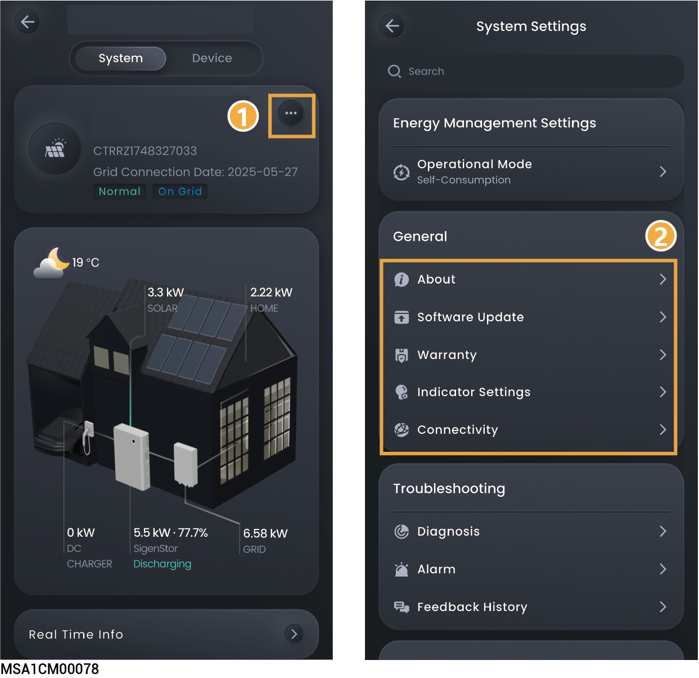

# 通用设置

<figure><figcaption></figcaption></figure>

<table><thead><tr><th width="70" align="center" valign="middle">序号</th><th width="182.9090576171875" valign="middle">参数名称</th><th valign="top">说明</th></tr></thead><tbody><tr><td align="center" valign="middle">1</td><td valign="middle">About</td><td valign="top">点击修改电站类型、名称、地址等。（3D电站类型需手动下载）。</td></tr><tr><td align="center" valign="middle">2</td><td valign="middle">Software Update</td><td valign="top">
点击可升级电站软件。
<ul><li>您可通过本功能知晓系统中设备软件是否为最新版本，并支持将设备升级为最新版本。</li><li><mark style="color:$danger;">点击后可升级电站所有思格设备，包含但不限于SigenStor、Sigen EV AC Charger、Gateway等。</mark></li></ul></td></tr><tr><td align="center" valign="middle">3</td><td valign="middle">Warranty</td><td valign="top">点击查看质保状态。</td></tr><tr><td align="center" valign="middle">4</td><td valign="middle">Indicator settings</td><td valign="top">设置为后，您可根据喜好设置设备LED灯显示效果。其中，当“LED Strips”设置为“Power Flow”时，从上往下流水灯效，表示电池包与充电桩充电中；从下往上流水灯效，表示电池包与充电桩放电中；常亮灯效表示电池包与充电桩非充非放状态。</td></tr><tr><td align="center" valign="middle">5</td><td valign="middle">Connectivity</td><td valign="top">查看网络连接类型。</td></tr></tbody></table>
