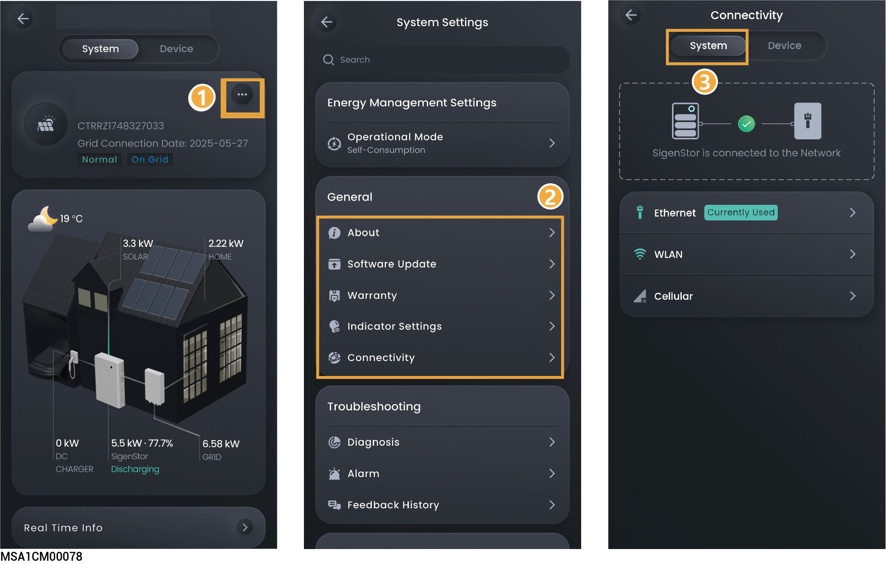

# 电站远端网络连接



<mark style="color:blue;">通信方式推荐采用FE和WLAN。CommMod赠送4G流量用完后，需用户自行充值或更换SIM卡。</mark>

<figure><figcaption></figcaption></figure>

<table><thead><tr><th width="70" align="center" valign="middle">序号</th><th width="116.9090576171875" valign="middle">参数名称</th><th valign="top">说明</th></tr></thead><tbody><tr><td align="center" valign="middle">1</td><td valign="middle">Ethernet</td><td valign="top">显示FE连接状态。在网络稳定情况下不建议拔插网线。</td></tr><tr><td align="center" valign="middle">2</td><td valign="middle">WLAN</td><td valign="top">
显示WLAN连接状态。此处支持为电站所有的设备配置需要连接的WLAN。
<ul><li>配置WLAN通信前，请确认设备已安装天线。</li><li>连接非加密WLAN，可能导致网络不可用，不推荐使用。</li><li>当设备仅可用WLAN连接网络时，不可切换其他无线路由器WLAN。</li></ul></td></tr><tr><td align="center" valign="middle">3</td><td valign="middle">Cellular</td><td valign="top">
显示4G连接状态。
<ul><li>当采用4G通信时，可查看当前每月使用的流量，同时可设置每月使用流量阈值。</li></ul></td></tr></tbody></table>
