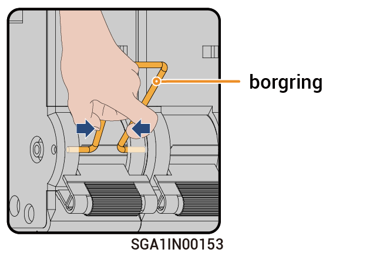

# Handelingen met de bypass-schakelaar



* <mark style="color:blue;">In normale gevallen is de bypass-schakelaar uitgeschakeld. Bedien de bypass-schakelaar niet. In dit geval kan de Gateway automatisch schakelen tussen on-grid en off-grid.</mark>
* <mark style="color:blue;">Wanneer de Gateway niet in staat is om stroom naar de belasting te leveren, kunt u de bypass-schakelaar inschakelen om stroom naar de belasting te leveren vanaf het elektriciteitsnet.</mark>

### Stappen

1. Controleer of het elektriciteitsnet normaal stroom levert.
2. Schakel de stroom uit volgens de instructies in [_Power Off._](power-off/)
3. Raadpleeg de vertragingstijd zoals aangegeven op het label op de apparatuur en wacht tot de aangegeven tijd is verstreken. Zodra de tijd verstreken is, verwijdert u de borgring van de bypassschakelaar en schakelt u de bypassschakelaar in.

<figure><figcaption></figcaption></figure>



* <mark style="color:orange;">Er is reststroom en de apparatuur is onmiddelijk na het uitschakelen heet. Het bedienen van de apparatuur direct na het uitschakelen kan leiden tot een elektrische schok of brandwonden.</mark>
* <mark style="color:orange;">Er is hoogspanning aanwezig in de apparatuur. Draag isolerende handschoenen bij het inschakelen van de schakelaar.</mark>



<mark style="color:purple;">Schakel, na het inschakelen van de bypass-schakelaar, de miniatuur stroomonderbreker die verbonden is met de omvormer en generator op de Gateway niet in. Anders wordt de netaansluiting geladen, wat het risico van een elektrische schok met zich meebrengt.</mark>

4. Schakel de miniatuur stroomonderbreker die verbonden is met de SPD in.
5. Schakel de miniatuur stroomonderbreker die verbonden is met het elektriciteitsnet in.
6. Schakel de miniatuur stroomonderbreker die verbonden is met de back-up huishoudelijke belasting in.
7. Sluit de deur van de apparatuur.
