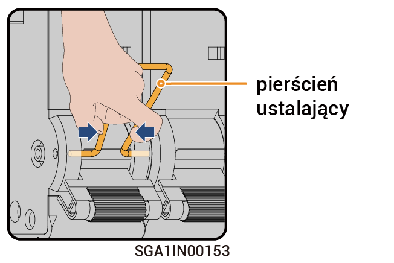

# Obsługa przełącznika obejściowego



* <mark style="color:blue;">W standardowych sytuacjach przełącznik obejściowy jest wyłączony. Nie dotykać przełącznika obejściowego. W takiej sytuacji brama może automatycznie przełączać tryb na sieciowy i wyspowy.</mark>
* <mark style="color:blue;">Gdy brama nie dostarczy zasilania do odbiorników, można włączyć przełącznik obejściowy, aby odbiorniki zasilane były z sieci energetycznej.</mark>

### Kroki

1. Sprawdzić, czy sieć dostarcza zasilanie.
2. Wyłączyć zasilanie, odwołując się do sekcji [_Wyłączanie zasilania._](power-off/)
3. Sprawdzić czas opóźnienia wskazany na etykiecie na urządzeniu i poczekać określony czas. Po upłynięciu czasu zdjąć pierścień ustalający z przełącznika obejściowego i włączyć przełącznik obejściowy.

<figure><figcaption></figcaption></figure>



* <mark style="color:orange;">Po wyłączeniu zasilania w urządzeniu występuje prąd resztkowy, a urządzenie jest gorące. Używanie sprzętu bezpośrednio po wyłączeniu zasilania może prowadzić do porażenia prądem lub oparzeń.</mark>
* <mark style="color:orange;">W urządzeniu występuje wysokie napięcie. Do obsługi przełącznika zakładać rękawice izolowane.</mark>



<mark style="color:purple;">Po włączeniu przełącznika obejściowego nie włączać miniaturowego wyłącznika podłączonego do falownika i generatora w bramie. W przeciwnym razie port sieci energetycznej będzie pod napięciem, co spowoduje ryzyko porażenia prądem.</mark>

4. Włączyć miniaturowy wyłącznik połączony z SPD.
5. Włączyć miniaturowy wyłącznik połączony z siecią energetyczną.
6. Włączyć miniaturowy wyłącznik połączony z odbiornikami domowymi z zasilaniem zapasowym.
7. Zamknąć pokrywę urządzenia.
