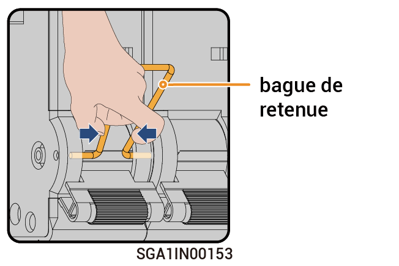

# Fonctionnement du commutateur de dérivation



* <mark style="color:blue;">Dans les conditions normales, le commutateur de dérivation est hors tension. N'actionnez pas le commutateur de dérivation. Dans ce cas, le Gateway peut automatiquement basculer entre l'alimentation en réseau et l'alimentation hors réseau.</mark>
* <mark style="color:blue;">Si le Gateway ne parvient pas à alimenter les charges, actionnez le commutateur de dérivation pour alimenter les charges à partir du réseau électrique.</mark>

### Procédure

1. Vérifiez que le réseau électrique fonctionne normalement.
2. Mettez hors tension en vous reportant à la rubrique [_Mise hors tension._](power-off/)
3. Reportez-vous au délai indiqué sur l'étiquette de l'équipement et attendez pendant le temps spécifié. Une fois le temps écoulé, retirez la bague de retenue du commutateur de dérivation et actionnez le commutateur de dérivation.

<figure><figcaption></figcaption></figure>



* <mark style="color:orange;">Un courant résiduel est présent et l'équipement est chaud immédiatement après sa mise hors tension. L'utilisation de l'équipement immédiatement après sa mise hors tension peut entraîner des décharges électriques ou des brûlures.</mark>
* <mark style="color:orange;">Une haute tension est présente dans l'équipement. Portez des gants isolants lorsque vous actionnez le commutateur.</mark>



<mark style="color:purple;">Après avoir actionné le commutateur de dérivation, n'enclenchez pas le disjoncteur miniature connecté à l'onduleur et au générateur sur le Gateway. Sinon, le port du réseau électrique sera chargé, ce qui entraînera un risque d'électrocution.</mark>

4. Enclenchez le disjoncteur miniature connecté au SPD (dispositif de protection contre les surtensions).
5. Enclenchez le disjoncteur miniature connecté au réseau électrique.
6. Enclenchez le disjoncteur miniature connecté au circuit de secours pour électroménager.
7. Fermez la porte de l'équipement.
