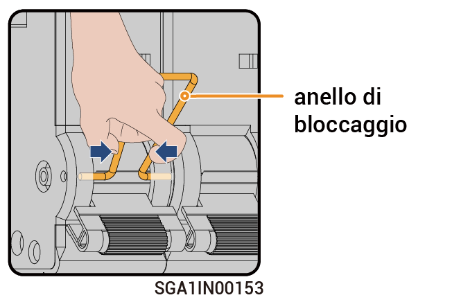

# Interventi sull'interruttore di bypass



* <mark style="color:blue;">In casi normali, l'interruttore di bypass è spento. Non azionare l'interruttore di bypass. In questo caso, il gateway può passare automaticamente alle modalità on-grid e off-grid.</mark>
* <mark style="color:blue;">Quando il gateway non riesce ad alimentare i carichi, si può accendere l'interruttore di bypass per alimentare i carichi tramite la rete.</mark>

### Passaggi

1. Verificare che la rete funzioni normalmente.
2. Spegnere come riportato in [_Spegnimento._](power-off/)
3. Fare riferimento al tempo di ritardo come indicato sull'etichetta del dispositivo e attendere il tempo specificato. Trascorso questo tempo, rimuovere l'anello di bloccaggio dall'interruttore di bypass e accendere quest'ultimo.

<figure><figcaption></figcaption></figure>



* <mark style="color:orange;">È presente una corrente residua e il dispositivo è caldo subito dopo averlo spento. Se si agisce sul dispositivo subito dopo averlo spento sussiste il rischio di folgorazione o ustione.</mark>
* <mark style="color:orange;">Nel dispositivo è presente un'alta tensione. Indossare guanti isolanti quando si accende l'interruttore.</mark>



<mark style="color:purple;">Dopo avere acceso l'interruttore di bypass, non accendere l'interruttore automatico in miniatura collegato all'inverter e al generatore sul gateway. In caso contrario, la porta della rete si caricherà, con il conseguente rischio di folgorazione.</mark>

4. Accendere l'interruttore automatico in miniatura collegato al dispositivo di protezione contro le sovratensioni (SPD).
5. Accendere l'interruttore automatico in miniatura collegato alla rete.
6. Accendere l'interruttore automatico in miniatura collegato ai carichi domestici che necessitano del backup.
7. Chiudere la porta del dispositivo.
