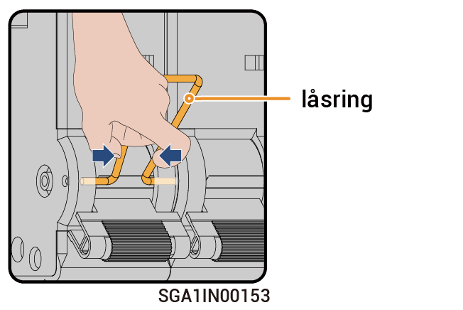

# Drift med förbikopplingsbrytare



* <mark style="color:blue;">I vanliga fall är förbikopplingsbrytaren frånslagen. Använd inte förbikopplingsbrytaren. I detta fall kan Gateway automatiskt växla mellan anslutning till och bortkoppling från elnätet.</mark>
* <mark style="color:blue;">När Gateway inte längre kan strömförsörja lasterna kan du aktivera förbikopplingsbrytaren så att lasterna försörjs av elnätet.</mark>

### Steg

1. Kontrollera att elnätet fungerar normalt.
2. Stäng av genom att följa [_Avstängning_](power-off/).
3. Se den fördröjningstid som anges på etiketten på utrustningen och vänta den angivna tiden. När tiden har passerat ska du avlägsna låsringen från förbikopplingsbrytaren och slå på brytaren.

<figure><figcaption></figcaption></figure>



* <mark style="color:orange;">Omedelbart efter avstängning är utrustningen fortfarande varm och restström finns i den. Om utrustningen driftsätts omedelbart efter avstängning finns det risk för elektrisk stöt eller brännskador.</mark>
* <mark style="color:orange;">Höga spänningar finns i utrustningen. Använd isolerande handskar när du slår på brytaren.</mark>



<mark style="color:purple;">När du har slagit på förbikopplingsbrytaren ska du inte slå på minikretsbrytaren ansluten till växelriktaren och generatorn på Gateway. Annars kommer elnätet att laddas, vilket utgör risk för elektrisk stöt.</mark>

4. Slå på minikretsbrytaren ansluten till SPD.
5. Slå på minikretsbrytaren ansluten till elnätet.
6. Slå på minikretsbrytaren ansluten till hushållets reservlaster.
7. Stäng luckan på utrustningen.
