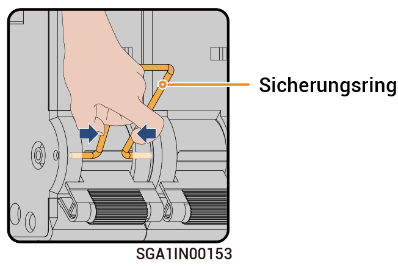

# Betrieb des Umgehungsschalters



* <mark style="color:blue;">Im Normalfall ist der Umgehungsschalter ausgeschaltet. Bedienen Sie den Umgehungsschalter nicht. In diesem Fall schaltet das Gateway automatisch zwischen netzverbunden und netzunabhängig um.</mark>
* <mark style="color:blue;">Wenn das Gateway keinen Strom an die Lasten liefert, können Sie den Umgehungsschalter einschalten, um mittels dem Stromnetz Strom an die Lasten zu liefern.</mark>

### Schritte

1. Überprüfen Sie, ob das Stromnetz normal Strom liefert.
2. Schalten Sie das Gerät über [_Ausschalten_](power-off/) aus.
3. Beziehen Sie sich auf die Verzögerungszeit der Beschriftung und warten Sie den angegebenen Zeitraum ab. Nach Ablauf der Zeit entfernen Sie den Sicherungsring vom Umgehungsschalter. Schalten Sie den Umgehungsschalter ein.

<figure><figcaption></figcaption></figure>



* <mark style="color:orange;">Es gibt einen Reststrom und die Geräte sind unmittelbar nach dem Ausschalten heiß. Wenn die Geräte unmittelbar nach dem Ausschalten wieder eingeschaltet werden, kann dies zu einem Stromschlag oder Verbrennungen führen.</mark>
* <mark style="color:orange;">Das Gerät steht unter Hochspannung. Beim Bedienen des Schalters Isolierhandschuhe tragen.</mark>



<mark style="color:purple;">Nach dem Einschalten des Umgehungsschalters darf der an den Wechselrichter und den Generator angeschlossene Kompaktleistungsschalter am Gateway nicht eingeschaltet werden. Andernfalls wird der Stromnetzanschluss aufgeladen, was zu einem Stromschlag führen kann.</mark>

4. Schalten Sie den an den Überspannungsschutz angeschlossenen Kompaktleitungsschutzschalter ein.
5. Schalten Sie den an das Stromnetz angeschlossenen Kompaktleistungsschalter ein.
6. Schalten Sie den an die Notstrom-Haushaltslasten angeschlossenen Kompaktleistungsschalter ein.
7. Schließen Sie die Gerätetür.
