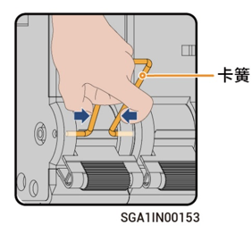

# 旁路开关操作



* <mark style="color:blue;">正常情况下，旁路开关应处于断开状态，禁止对旁路开关进行操作。此时备电柜可自动进行并离网切换。</mark>
* <mark style="color:blue;">当由于备电柜异常导致无法给负载供电时，可闭合旁路开关，通过电网给负载供电。</mark>

### 操作步骤

1. 确认电网侧有电。
2. 参见[设备下电](power-off/) 完成下电操作
3. 参考设备上的延时标签，等待对应的时间，取下旁路开关上的卡簧后，闭合旁路开关。

<figure><figcaption></figcaption></figure>



* <mark style="color:orange;">设备下电后，存在残余电流与余热，下电后立马操作，可能会造成电击与灼伤。</mark>
* <mark style="color:orange;">设备存在高电压，在闭合开关时，请佩戴绝缘手套。</mark>



<mark style="color:purple;">旁路开关闭合后，禁止闭合备电柜上连接逆变器和油机的微型断路器，否则将导致电网端口带电，有触电风险。</mark>

4. 闭合连接浪涌保护器的微型断路器。
5. 闭合连接电网的微型断路器。
6. 闭合连接家用备电负载的微型断路器。
7. 关闭设备柜门。
