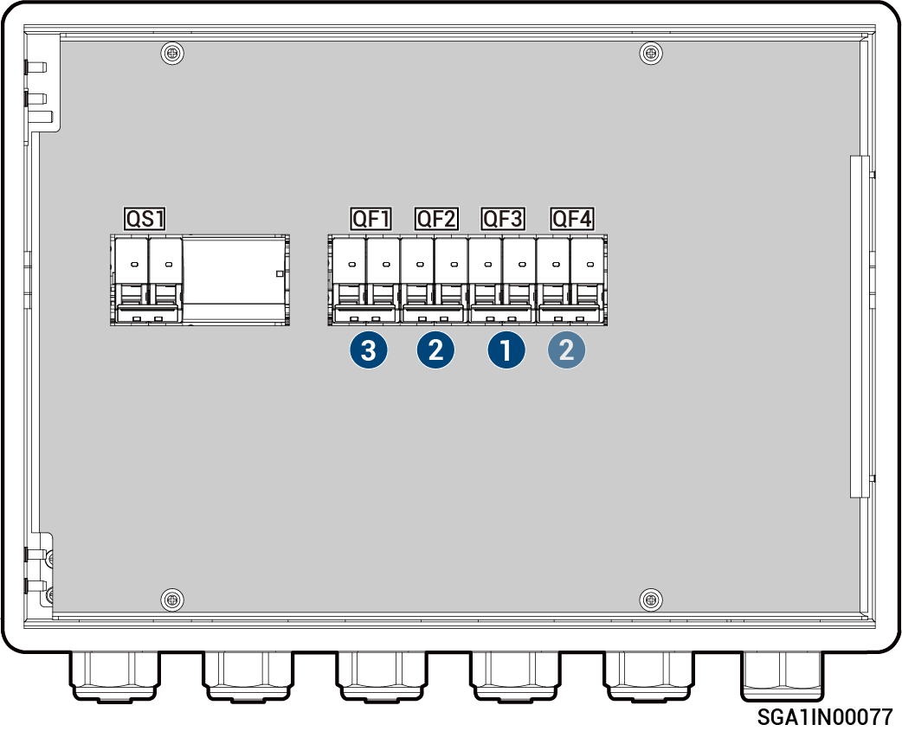

# Sigen Gateway Home SP 12K

<figure><figcaption></figcaption></figure>



<mark style="color:orange;">Il gateway deve essere scollegato nell'ordine seguente:</mark>

1. <mark style="color:orange;">Spegnere l'interruttore automatico in miniatura QF3 (collegato ai carichi domestici che necessitano del backup).</mark>
2. <mark style="color:orange;">Dopo avere spento l'inverter, spegnere l'interruttore automatico in miniatura QF2 o QF4 (collegato all'inverter).</mark>
3. <mark style="color:orange;">Spegnere l'interruttore automatico in miniatura QF1 (collegato alla rete).</mark>
