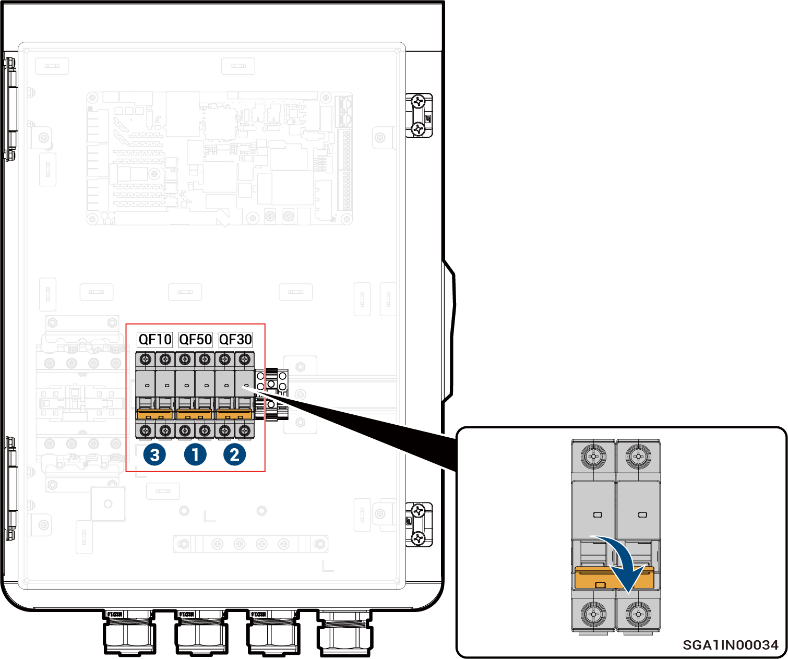

# Sigen Gateway Home SP

<figure><figcaption></figcaption></figure>



<mark style="color:orange;">Odłączanie bramy przeprowadza się w następującej kolejności.</mark>

1. <mark style="color:orange;">Wyłączyć miniaturowy wyłącznik QF50 (połączony z odbiornikami domowymi z zasilaniem zapasowym).</mark>
2. <mark style="color:orange;">Po wyłączeniu falownika wyłączyć miniaturowy wyłącznik QF30 (połączony z falownikiem).</mark>
3. <mark style="color:orange;">Wyłączyć miniaturowy wyłącznik QF10 (połączony z siecią energetyczną).</mark>
