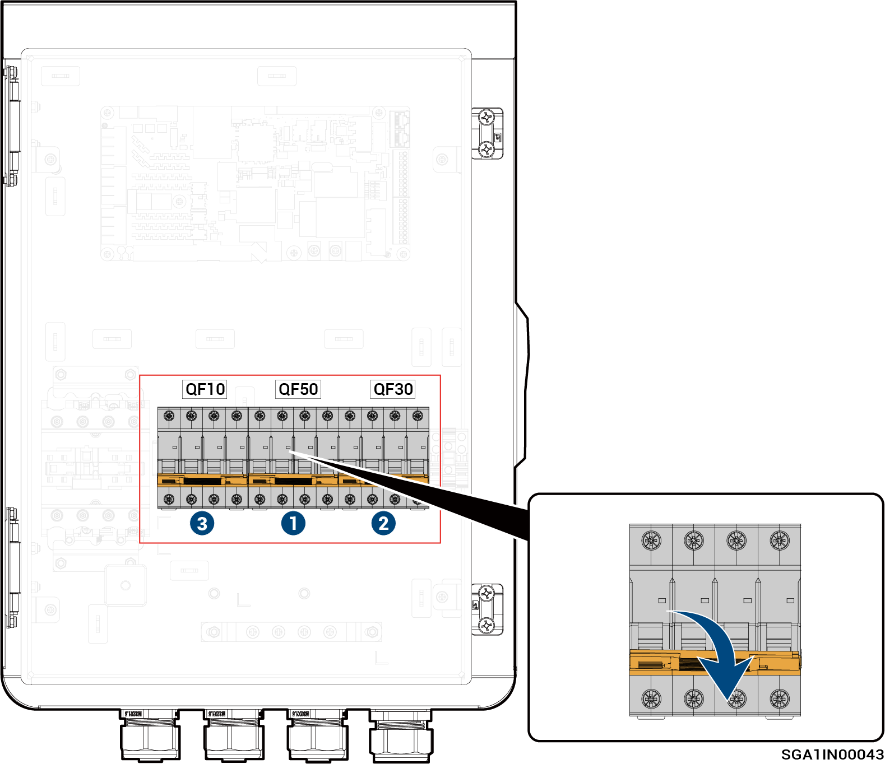

# Sigen Gateway Home TP

<figure><figcaption></figcaption></figure>



<mark style="color:orange;">Gateway irrotetaan seuraavassa järjestyksessä:</mark>

1. <mark style="color:orange;">Kytke pois päältä pienkatkaisija QF50 (liitetty kotitalouskuormien varavoimaan).</mark>
2. <mark style="color:orange;">Invertterin sammuttamisen jälkeen kytke pois päältä pienkatkaisija QF30 (liitetty invertteriin).</mark>
3. <mark style="color:orange;">Kytke pois päältä pienkatkaisija QF10 (liitetty sähköverkkoon).</mark>
