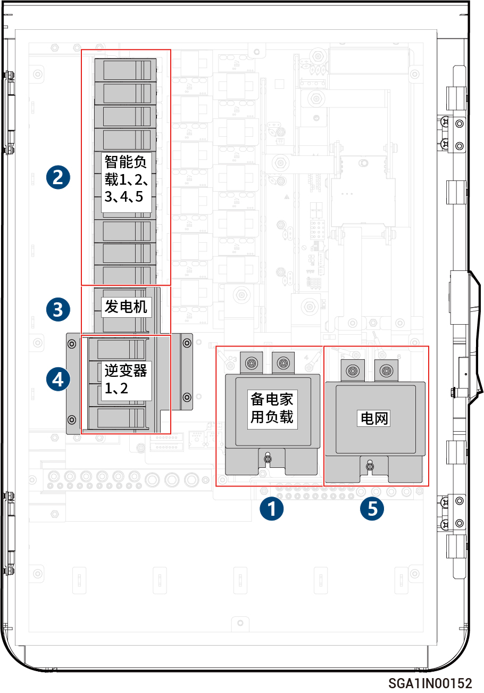

# Sigen Gateway HomeMax SP LA

<figure><figcaption></figcaption></figure>



<mark style="color:orange;">请按如下顺序分闸：</mark>

1. <mark style="color:orange;">断开微型断路器（连接备电家用负载）。</mark>
2. <mark style="color:orange;">断开微型断路器（连接智能负载）。</mark>
3. <mark style="color:orange;">（可选）断开微型断路器（连接发电机）。</mark>
4. <mark style="color:orange;">逆变器关机后，断开微型断路器（连接逆变器）。</mark>
5. <mark style="color:orange;">断开微型断路器（连接电网）。</mark>
