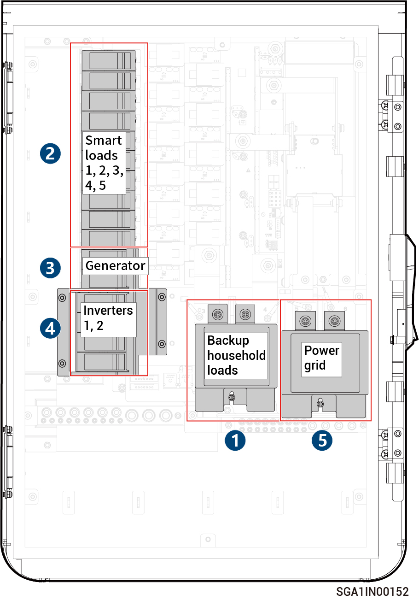

# Sigen Gateway HomeMax SP LA

<figure><figcaption></figcaption></figure>



<mark style="color:orange;">The Gateway should be disconnected in the following order:</mark>

1. <mark style="color:orange;">Switch off the miniature circuit breaker (connecting to Backup Household loads).</mark>
2. <mark style="color:orange;">Switch off the miniature circuit breaker (connecting to Smart load).</mark>
3. <mark style="color:orange;">(Optional) Switch off the miniature circuit breaker (connecting to Generator).</mark>
4. <mark style="color:orange;">After shutting down the inverter, switch off the miniature circuit breaker  (connecting to Inverter).</mark>
5. <mark style="color:orange;">Switch off the miniature circuit breaker (connecting to Power grid).</mark>

