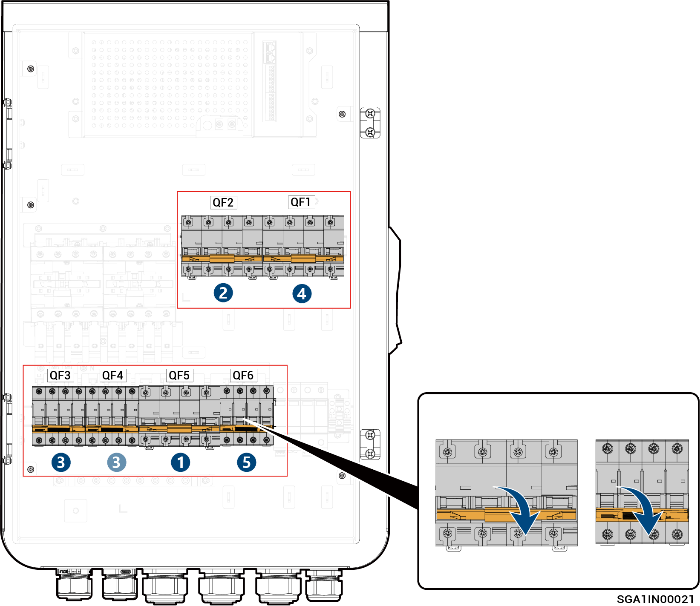

# Sigen Gateway HomeMax TP

<figure><figcaption></figcaption></figure>



<mark style="color:orange;">Gateway irrotetaan seuraavassa järjestyksessä:</mark>

1. <mark style="color:orange;">Kytke pois päältä pienkatkaisija QF5 (liitetty kotitalouskuormien varavoimaan).</mark>
2. <mark style="color:orange;">(Valinnainen) Kytke pois päältä pienkatkaisija QF2 (liitetty generaattoriin / älykkääseen kuormaan).</mark>
3. <mark style="color:orange;">Invertterin sammuttamisen jälkeen kytke pois päältä pienkatkaisija QF3 tai QF4 (liitetty invertteriin).</mark>
4. <mark style="color:orange;">Kytke pois päältä pienkatkaisija QF1 (liitetty sähköverkkoon).</mark>
5. <mark style="color:orange;">Kytke pois päältä ylijännitesuojakytkin QF6.</mark>
