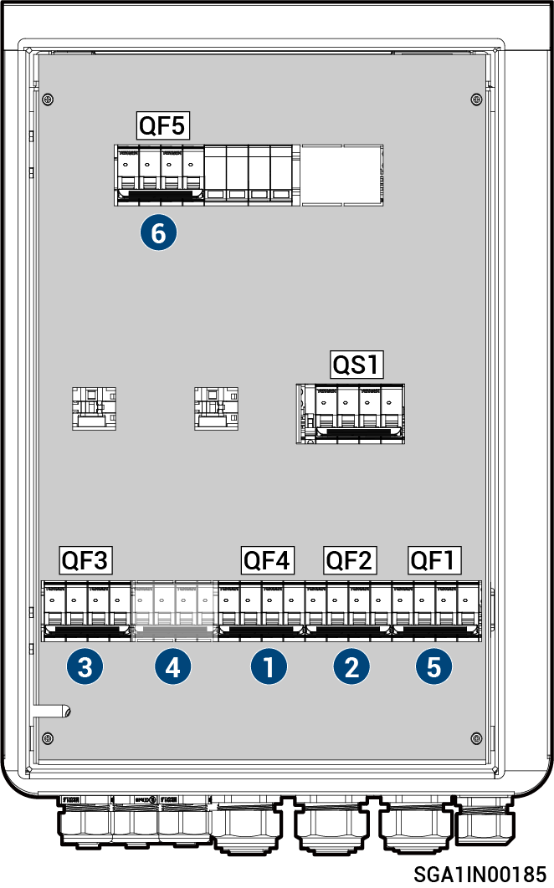

# Sigen Gateway HomePro TP

<figure><figcaption></figcaption></figure>



<mark style="color:orange;">The Gateway should be disconnected in the following order:</mark>

1. <mark style="color:orange;">Switch off the miniature circuit breaker QF4 (connecting to Backup Household loads).</mark>
2. <mark style="color:orange;">(Optional) Switch off the miniature circuit breaker QF2 (connecting to Generator/Smart load).</mark>
3. <mark style="color:orange;">After shutting down the inverter, switch off the miniature circuit breaker QF3 (connecting to Inverter 1).</mark>
4. <mark style="color:orange;">(optional) If installing a self-supplied circuit breaker, you can switch off the miniature circuit breaker (connecting to Inverter 2).</mark>
5. <mark style="color:orange;">Switch off the miniature circuit breaker QF1 (connecting to Power grid).</mark>
6. <mark style="color:orange;">Switch off the surge protective device switch QF5.</mark>

