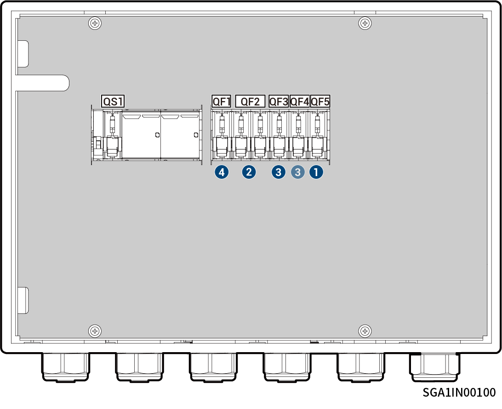

# Sigen Gateway SP AU

<figure><figcaption></figcaption></figure>



<mark style="color:orange;">Das Gateway sollte in der folgenden Reihenfolge getrennt werden:</mark>

1. <mark style="color:orange;">Schalten Sie den Kompaktleistungsschalter QF5 aus (Anschluss an die Notstromversorgung für Haushaltslasten).</mark>
2. <mark style="color:orange;">(Optional) Schalten Sie den Kompaktleistungsschalter QF2 aus (Anschluss an Generator/Intelligente Verbraucher).</mark>
3. <mark style="color:orange;">Nach dem Abschalten des Wechselrichters schalten Sie den Leitungsschutzschalter QF3 oder QF4 (Anschluss an den Wechselrichter) aus.</mark>
4. <mark style="color:orange;">Schalten Sie den Kompaktleistungsschalter QF1 (Anschluss an das Stromnetz) aus.</mark>
