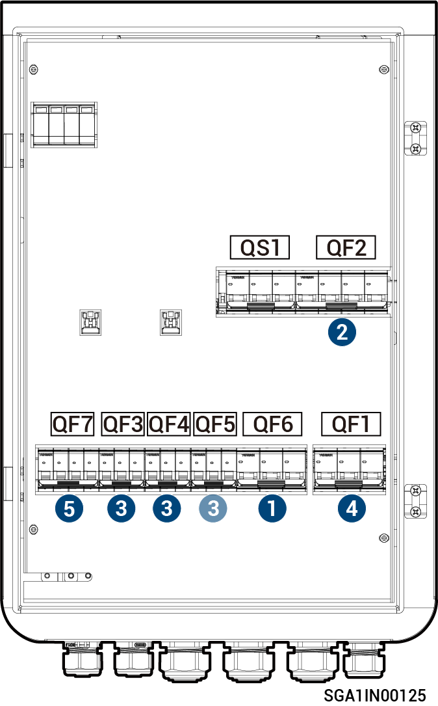

# Sigen Gateway (TP AU, HomeMax TP CN)

<figure><figcaption></figcaption></figure>



<mark style="color:orange;">Odłączanie bramy przeprowadza się w następującej kolejności.</mark>

1. <mark style="color:orange;">Wyłączyć miniaturowy wyłącznik QF6 (połączony z odbiornikami domowymi z zasilaniem zapasowym).</mark>
2. <mark style="color:orange;">(Opcja) wyłączyć miniaturowy wyłącznik QF2 (połączony z generatorem/odbiornikami inteligentnymi).</mark>
3. <mark style="color:orange;">Po wyłączeniu falownika wyłączyć miniaturowy wyłącznik QF3, QF4 lub QF5 (połączony z falownikiem).</mark>
4. <mark style="color:orange;">Wyłączyć miniaturowy wyłącznik QF1 (połączony z siecią energetyczną).</mark>
5. <mark style="color:orange;">Wyłączyć przełącznik urządzenia przeciwprzepięciowego QF7.</mark>
