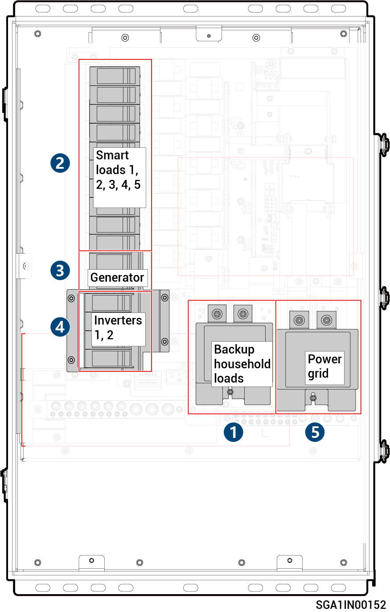

# Sigen LoadHub

<figure><figcaption></figcaption></figure>



<mark style="color:orange;">The loadhub should be disconnected in the following order:</mark>

1. <mark style="color:orange;">Turn off the miniature circuit breaker (connecting to Backup household loads).</mark>
2. <mark style="color:orange;">Turn off the miniature circuit breaker (connecting to Smart loads).</mark>
3. <mark style="color:orange;">Turn off the miniature circuit breaker (connecting to Generator).</mark>
4. <mark style="color:orange;">After shutting down the inverter on the phone, turn off the miniature circuit breaker (connecting to an Inverter).</mark>
5. <mark style="color:orange;">Turn off the miniature circuit breaker (connecting to Power grid).</mark>
