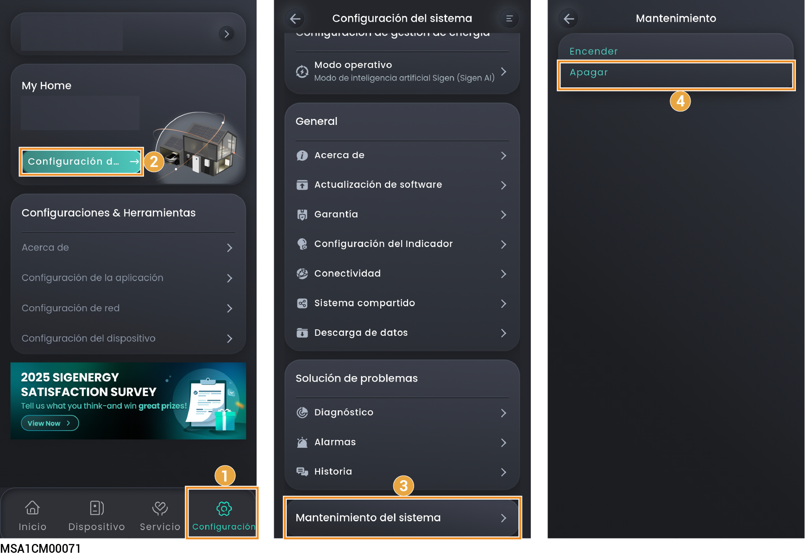
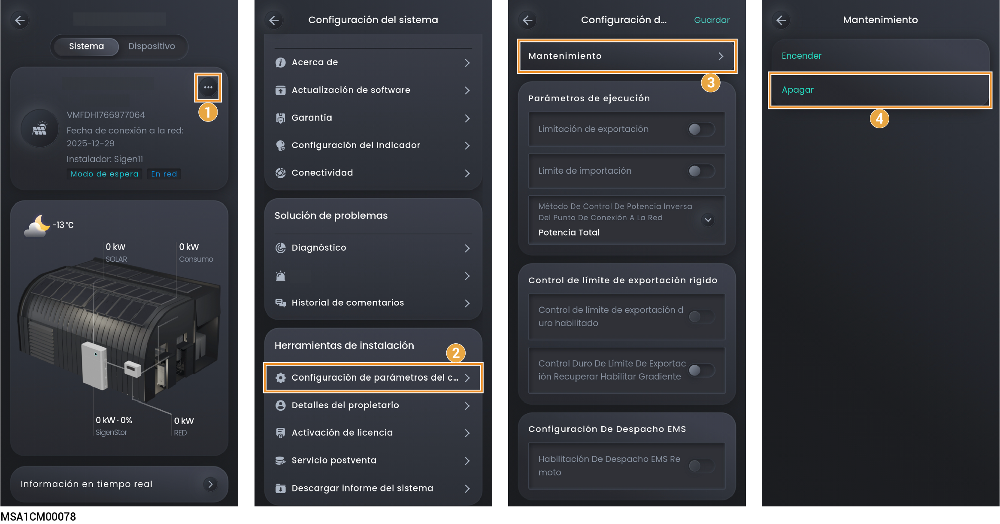

# Encendido/apagado del sistema



<mark style="color:red;">Alta tensión y riesgos:</mark>

<mark style="color:red;">Utilice equipo de protección personal como guantes y zapatos aislantes y casco cuando maneje el equipo. No lleve puestos accesorios conductores, como pulseras, anillos o collares metálicos.</mark>

## Apagado del sistema

1. Apague el equipo en la aplicación.

### **Cuenta del propietario**

<figure><figcaption></figcaption></figure>

### **Cuenta del instalador**

<figure><figcaption></figcaption></figure>

2. Apague el interruptor conectado al equipo en el panel de distribución de energía de reserva.
3. Ponga el Interruptor de CC del equipo en la posición APAGADO.
4. Cuando todos los indicadores LED del equipo se apaguen, espere el tiempo de demora que se indica en la etiqueta del equipo antes de continuar.



<mark style="color:orange;">Hay corriente residual y el equipo está caliente inmediatamente después de apagarlo. Realizar una acción en el equipo inmediatamente después de apagarlo puede provocar descargas eléctricas o quemaduras.</mark>

## Encendido del sistema

1. Ponga el Interruptor de CC del equipo en la posición ENCENDIDO.
2. Encienda el interruptor conectado al equipo en el panel de distribución de energía de reserva.
3. Encienda el equipo en la aplicación. Los detalles se explican en Paso 1 de Apagado del sistema.
