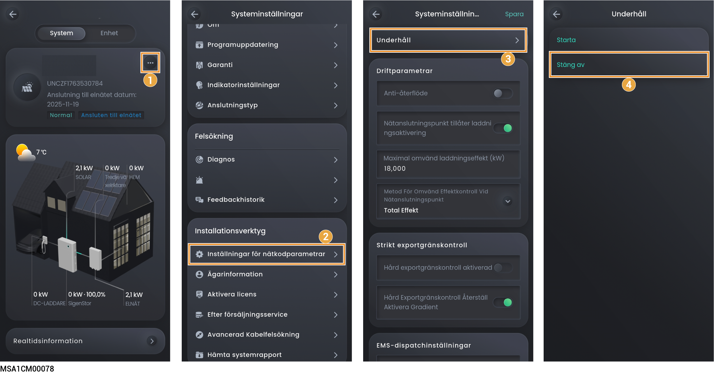

# Slå på/stänga av systemet



<mark style="color:red;">Högspänning och faror:</mark>

<mark style="color:red;">Använd personlig skyddsutrustning, t.ex. isolerande handskar, isolerande skor och skyddshjälm, när du använder utrustningen. Bär inte ledande saker, t.ex. armband, ringar eller halsband av metall.</mark>

## Stäng av systemet

1. Stäng av utrustningen i appen.

### **Ägarens konto**

<figure><figcaption></figcaption></figure>

### **Installatörens konto**

<figure><figcaption></figcaption></figure>

2. Stäng av strömbrytaren som är ansluten till utrustningen i reservkraftsfördelningspanelen.
3. Vrid DC-brytaren på utrustningen till läge AV.
4. När alla LED-indikatorer på utrustningen har slocknat ska du vänta i motsvarande tid som anges på etiketten på utrustningen innan du fortsätter.



<mark style="color:orange;">Det finns restström och utrustningen är varm omedelbart efter att utrustningen har stängts av. Om du använder utrustningen omedelbart efter att strömmen har slagits av kan det leda till elektriska stötar eller brännskador.</mark>

## Systemet slås på

1. Vrid DC-brytaren på utrustningen till läge PÅ.
2. Slå på strömbrytaren som är ansluten till utrustningen i reservkraftfördelningspanelen.
3. Slå på utrustningen i appen. För mer information, se Steg 1 i Avstängning av systemet.
