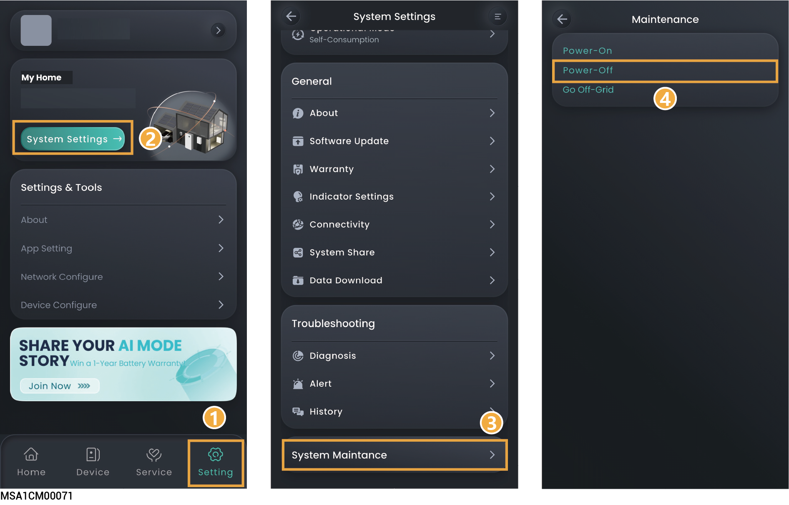
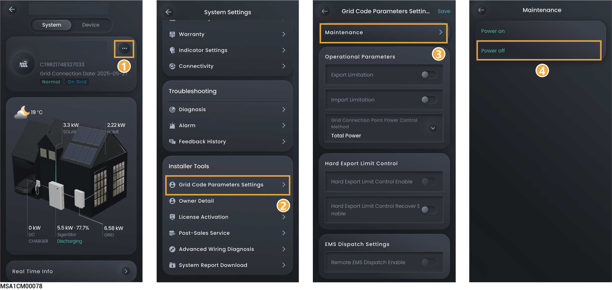

# Systemtænding/slukning



<mark style="color:red;">Højspænding og farer:</mark>

<mark style="color:red;">Bær personligt beskyttelsesudstyr såsom isolerende handsker, isolerende sko og sikkerhedshjelm ved betjening af udstyret. Bær ikke ledende smykker som metalarmbånd, ringe eller halskæder.</mark>

## Slukning af systemet

1. Sluk udstyret i appen.

### **Ejerkonto**

<figure><figcaption></figcaption></figure>

### **Installatørkonto**

<figure><figcaption></figcaption></figure>

2. Sluk for kontakten, der er tilsluttet udstyret i fordelingspanelet til backup-strøm.
3. Sæt DC SWITCH på udstyret i OFF-position.
4. Når alle LED-indikatorer på udstyret er slukket, skal du vente i det angivne tidsrum, som er angivet på mærkaten på udstyret, før du fortsætter.



<mark style="color:orange;">Der er reststrøm, og udstyret er varmt umiddelbart efter, at udstyret er slukket. Betjening af udstyret umiddelbart efter afbrydelse af strømmen kan føre til elektrisk stød eller forbrændinger.</mark>

## Tænding af systemet

1. Sæt DC SWITCH på udstyret i ON-position.
2. Tænd for kontakten, der er tilsluttet udstyret i fordelingspanelet til backup-strøm.
3. Tænd for udstyret i appen. For detaljer, se trin 1 i Slukning af systemet.
