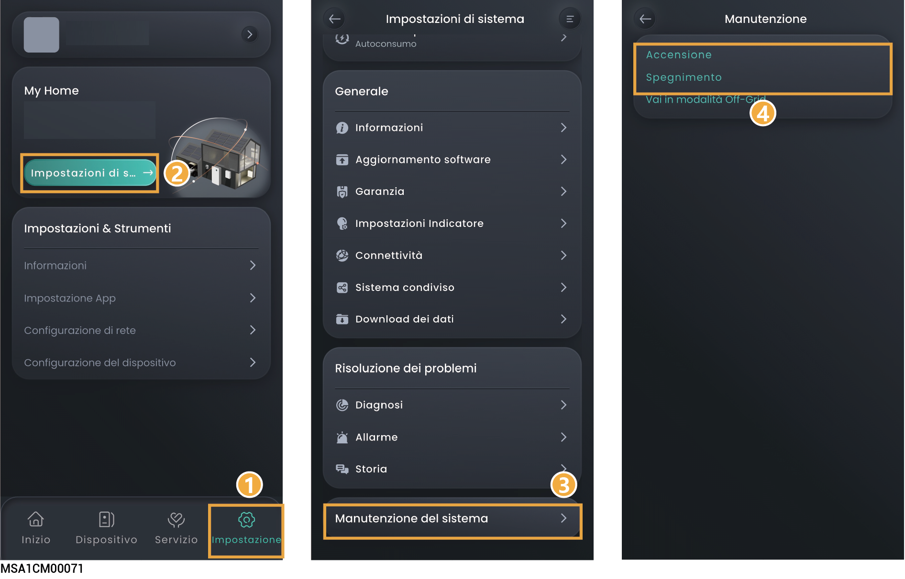

# Accensione/spegnimento del sistema



<mark style="color:red;">Alta tensione e pericoli:</mark>

<mark style="color:red;">Indossare i dispositivi di protezione individuale come guanti isolanti, scarpe isolanti ed elmetti quando si aziona il dispositivo. Non indossare accessori conduttori come bracciali metallici, anelli o collane.</mark>

## Spegnimento del sistema

1. Spegnere il dispositivo tramite l'app.

### **Account del proprietario**

<figure><figcaption></figcaption></figure>

### **Account dell'installatore**

<figure><figcaption></figcaption></figure>

2. Spegnere l'interruttore collegato al dispositivo nel quadro di distribuzione dell'alimentazione di backup.
3. Ruotare l'interruttore CC del dispositivo in posizione "SPENTO".
4. Dopo che tutti gli indicatori LED del dispositivo si sono spenti, attendere il tempo corrispondente indicato sull'etichetta del dispositivo prima di procedere.



<mark style="color:orange;">Subito dopo lo spegnimento del dispositivo, è presente una corrente residua e il dispositivo è caldo. Agendo sul dispositivo subito dopo lo spegnimento si può incorrere in scosse elettriche o ustioni.</mark>

## Accensione del sistema

1. Ruotare l'interruttore CC del dispositivo in posizione "ACCESO".
2. Accendere l'interruttore collegato al dispositivo nel quadro di distribuzione dell'alimentazione di backup.
3. Accendere il dispositivo tramite l'app. Per maggiori dettagli, fare riferimento al Passaggio 1 riportato nella sezione Spegnimento del sistema.
