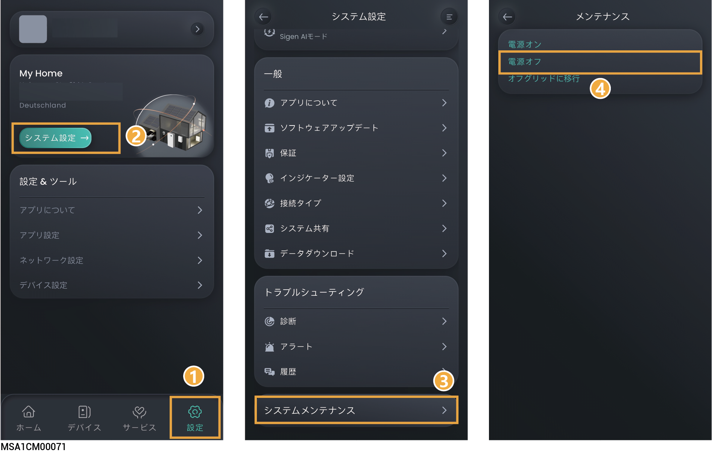
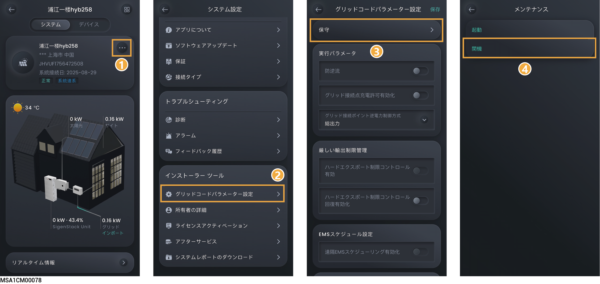

# システムの電源オン/電源オフ



<mark style="color:red;">高電圧と危険性：</mark>

<mark style="color:red;">装置を操作する際は、絶縁手袋、絶縁靴、安全帽子など個人用保護機器を着用してください</mark>。金属製のブレスレット、指輪、ネックレスなどの導電性アクセサリーは着用しないでください。

## システムの電源オフ

1. アプリで機器の電源を切ります。

### **所有者アカウント**

<figure><figcaption></figcaption></figure>

### **設置業者アカウント**

<figure><figcaption></figcaption></figure>

2\. バックアップ配電盤の機器に接続されているスイッチを切ります。

3\. 機器のDCスイッチをオフの位置にします。

4\. 機器のLEDインジケーターがすべて消えたら、機器のラベルで指示されている時間だけ待ってから、作業を続行します。



<mark style="color:orange;">機器の電源を切った直後は、電流がまだ残留しており、機器が高温になっています。電源を切った直後に機器を操作すると、感電や火傷をする恐れがあります。</mark>

## システムの電源オン

1. 機器のDCスイッチをオンの位置にします。
2. バックアップ配電盤の機器に接続されているスイッチを入れます。
3. アプリで機器の電源を入れます。詳細は、「システムの電源オフ」の手順1を参照してください。
