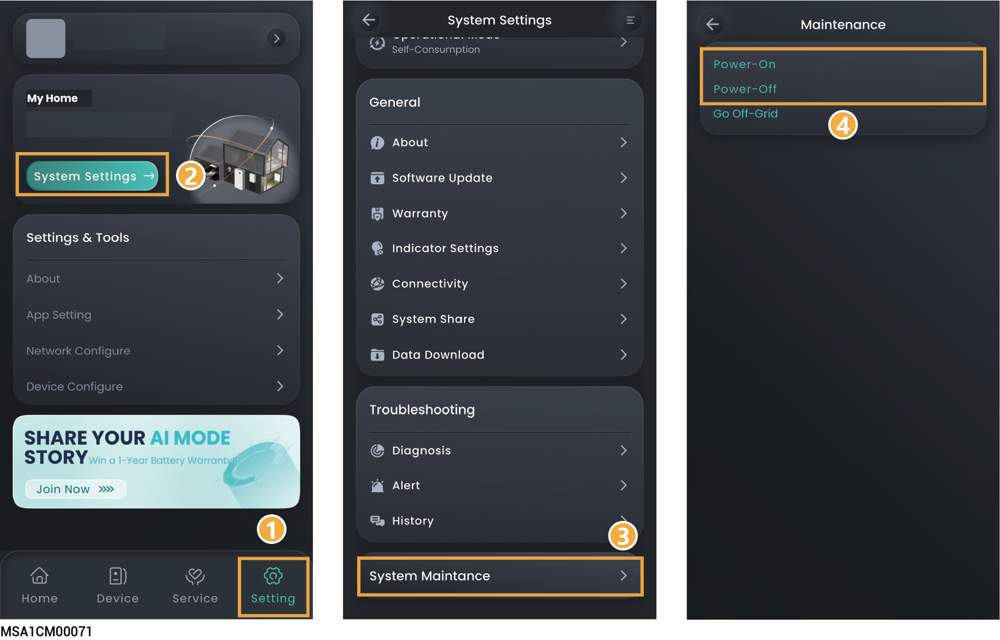
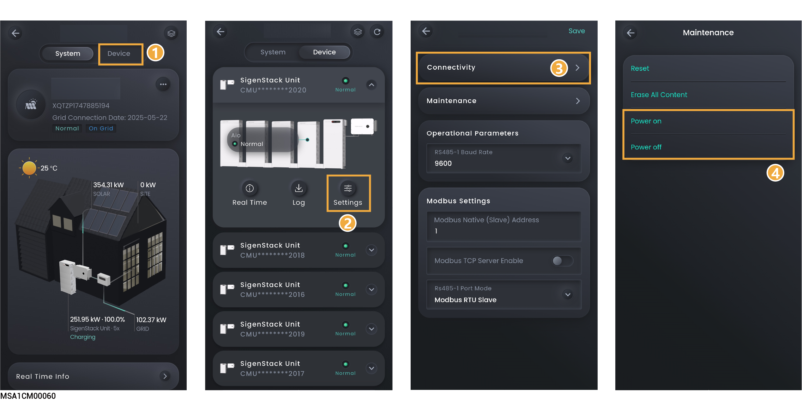

# System Power-on/Power-off



<mark style="color:red;">High Voltage and Hazards:</mark>

<mark style="color:red;">Wear personal protective equipment such as insulating gloves, insulating shoes, and safety hats while operating the equipment. Do not wear conductive accessories such as metal bracelets, rings, or necklaces.</mark>

## System power-off

1. Power the equipment off in the App.

### **Owner's Account**

<figure><figcaption></figcaption></figure>

### **Installer's Account**

<figure><figcaption></figcaption></figure>

2. Turn off the switch connected to the equipment in the backup power distribution panel.
3. Turn DC SWITCH on the equipment to the OFF position.
4. After all LED indicators on the equipment go off, wait for the corresponding time as indicated on the label on the equipment before proceeding.



<mark style="color:orange;">There is residual current and the equipment is hot immediately after the equipment is powered off. Operating the equipment immediately upon power off may lead to electric shock or burns.</mark>

## System power-on

1. Turn DC SWITCH on the equipment to the ON position.
2. Turn on the switch connected to the equipment in the backup power distribution panel.
3. Power the equipment on in the App. For details, see Step 1 in System power-off.
