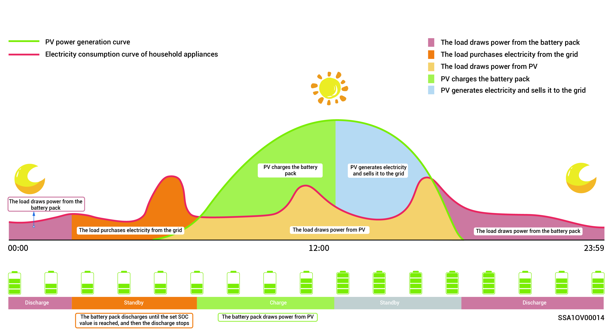

# Backup power setup



* <mark style="color:blue;">Skip this section if no Gateway is configured.</mark>
* <mark style="color:blue;">Users can manually set this parameter according to the power interruption frequency of their regions and leave time.</mark>

If there is a gateway in your networking, you can manually set the "Backup Reserve" value in the mySigen App. In grid connection mode, the battery stops discharging when the backup power SOC setting is reached. In the event of grid power outage, the backup power becomes available.

For example, the backup power SOC is set in Self-Consumption Mode.

<figure><figcaption></figcaption></figure>
