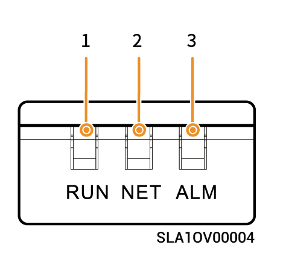

# LED Indicator State

## **Inverter Indicator**



<mark style="color:blue;">There are two types of indicators: a yellow indicator, see Light Language 1, and a blue indicator, see Light Language 2.</mark>

### Light Language 1

<figure><figcaption></figcaption></figure>

### Light Language 2

<figure><figcaption></figcaption></figure>

## **Sigen CommMod Indicator**

<figure><figcaption></figcaption></figure>

<table><thead><tr><th width="57.50506591796875" align="center">S/N</th><th>Name</th><th>State</th><th>Description</th></tr></thead><tbody><tr><td align="center">1</td><td>Power indicator</td><td>-</td><td>-</td></tr><tr><td align="center">2</td><td>Network state indicator</td><td>Slow flashing (200 ms on/1800 ms off)</td><td>The network is being connected</td></tr><tr><td align="center">2</td><td>Network state indicator</td><td>Slow flashing (1800 ms on/200 ms off)</td><td>Standby</td></tr><tr><td align="center">2</td><td>Network state indicator</td><td>Quick flashing (125 ms on/125 ms off)</td><td>Data is being transferred</td></tr></tbody></table>

## Sigen Data Logger indicator

<figure><figcaption></figcaption></figure>

<table><thead><tr><th width="68.99993896484375" align="center" valign="middle">No.</th><th width="189.22216796875" valign="middle">Indicator</th><th width="105.6666259765625" align="center" valign="middle">Color</th><th width="100.111083984375" valign="middle">Status</th><th valign="top">Meaning</th></tr></thead><tbody><tr><td align="center" valign="middle">1</td><td valign="middle">Running light</td><td align="center" valign="middle"></td><td valign="middle">Always on</td><td valign="top">Normal operation (500ms ON / 500ms OFF cycle)</td></tr><tr><td align="center" valign="middle">2</td><td valign="middle">Running light</td><td align="center" valign="middle"></td><td valign="middle">–</td><td valign="top">Abnormal operation</td></tr><tr><td align="center" valign="middle">3</td><td valign="middle">Communication light</td><td align="center" valign="middle"></td><td valign="middle">Always on</td><td valign="top">The management system has been connected via FE or WLAN.</td></tr><tr><td align="center" valign="middle">4</td><td valign="middle">Communication light</td><td align="center" valign="middle"></td><td valign="middle">–</td><td valign="top">Communication error.</td></tr><tr><td align="center" valign="middle">5</td><td valign="middle">Fault light</td><td align="center" valign="middle"></td><td valign="middle">Always on</td><td valign="top">System alarm.</td></tr><tr><td align="center" valign="middle">6</td><td valign="middle">Fault light</td><td align="center" valign="middle"></td><td valign="middle">–</td><td valign="top">The system has no alarms.</td></tr></tbody></table>
