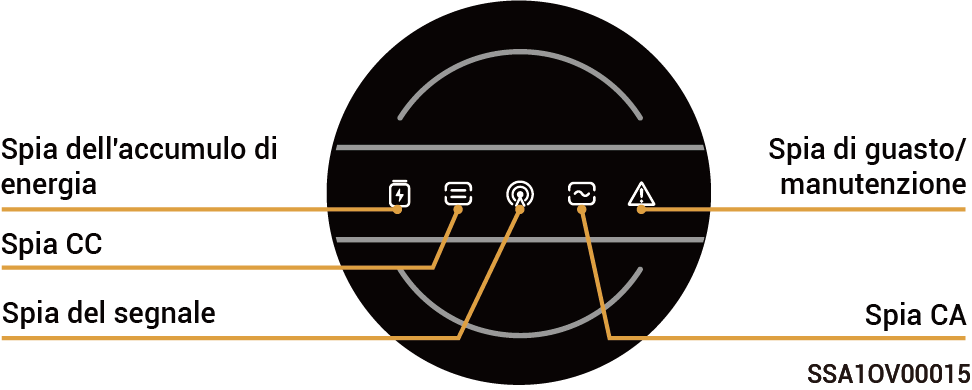
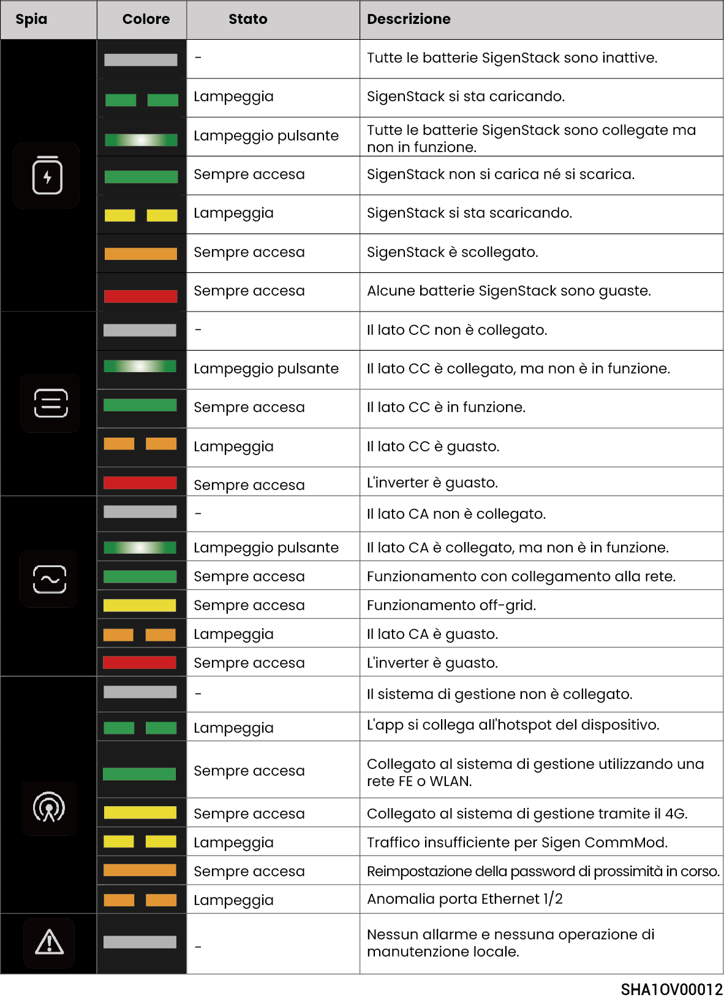
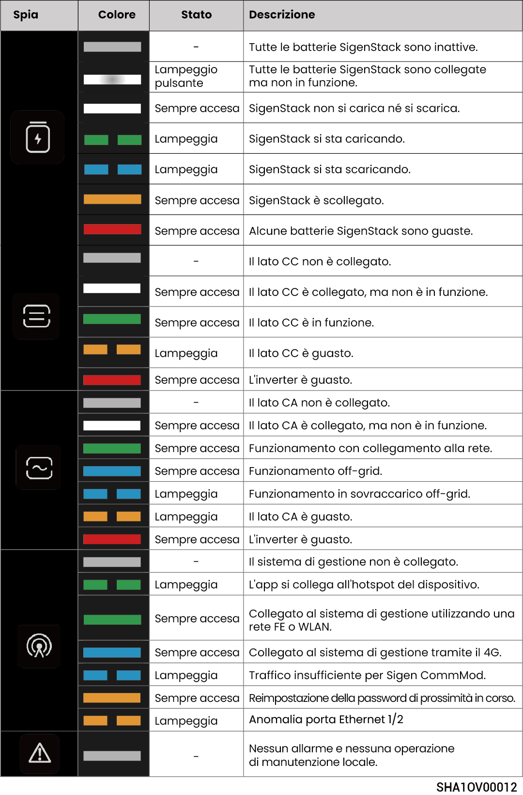

# Stato dell'indicatore LED

## **Indicatore dell'inverter**



<mark style="color:blue;">Esistono due tipi di spie: una spia gialla (si veda Linguaggio luminoso 1) e una spia blu (si veda Linguaggio luminoso 2).</mark>

### Linguaggio luminoso 1

<figure><figcaption></figcaption></figure>

<figure><figcaption></figcaption></figure>

### Linguaggio luminoso 2

<figure><figcaption></figcaption></figure>

<figure><figcaption></figcaption></figure>

## **Indicatore Sigen CommMod**

<figure><figcaption></figcaption></figure>

<table><thead><tr><th width="57.50506591796875" align="center">N.</th><th width="149.272705078125">Nome</th><th width="248.54547119140625">Stato</th><th>Descrizione</th></tr></thead><tbody><tr><td align="center">1</td><td>Indicatore di accensione</td><td>-</td><td>-</td></tr><tr><td align="center">2</td><td>Indicatore di stato della rete</td><td>Lampeggia lentamente (200 ms acceso/1800 ms spento)</td><td>Il collegamento alla rete è in corso</td></tr><tr><td align="center">2</td><td>Indicatore di stato della rete</td><td>Lampeggia lentamente (1800 ms acceso/200 ms spento)</td><td>standby</td></tr><tr><td align="center">2</td><td>Indicatore di stato della rete</td><td>Lampeggia rapidamente (125 ms acceso/125 ms spento)</td><td>il trasferimento dei dati è in corso</td></tr></tbody></table>
