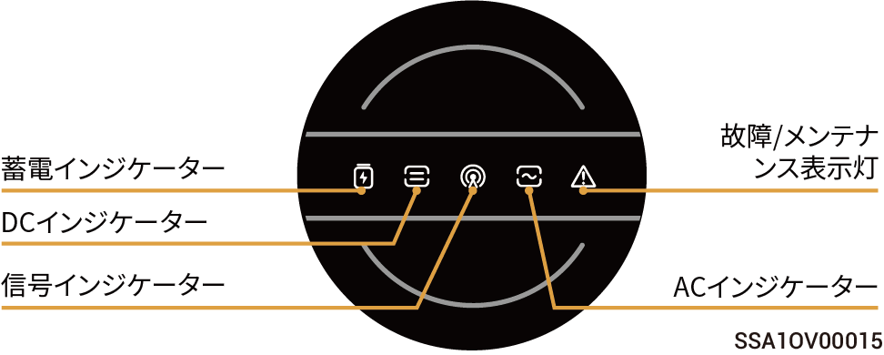
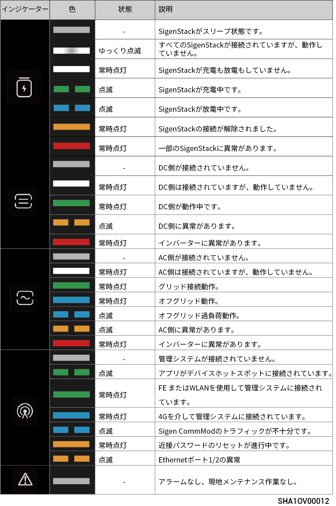
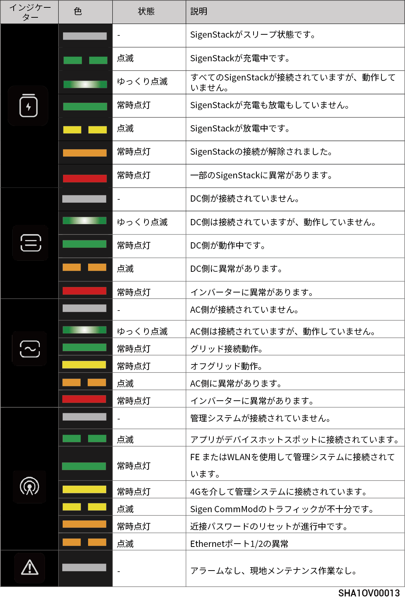

# LEDインジケーターの状態

## **インバータインジケーター**



<mark style="color:blue;">インジケーターには、黄色のインジケーター（光言語1を参照）と青色のインジケーター（光言語2を参照）の2種類があります。</mark>

### 光言語1

<figure><figcaption></figcaption></figure>

<figure><figcaption></figcaption></figure>

### 光言語2

<figure><figcaption></figcaption></figure>

<figure><figcaption></figcaption></figure>

## **Sigen CommModインジケーター**

<figure><figcaption></figcaption></figure>

<table><thead><tr><th width="57.50506591796875" align="center">S/N</th><th>名称</th><th>状態</th><th>説明</th></tr></thead><tbody><tr><td align="center">1</td><td>電源インジケーター</td><td>-</td><td>-</td></tr><tr><td align="center">2</td><td>ネットワーク状態インジケーター</td><td>ゆっくり点滅 (200 ms点灯/1800 ms消灯)</td><td>ネットワークの接続中</td></tr><tr><td align="center">2</td><td>ネットワーク状態インジケーター</td><td>ゆっくり点滅 (1800 ms点灯/200 ms消灯)</td><td>スタンバイ</td></tr><tr><td align="center">2</td><td>ネットワーク状態インジケーター</td><td>速く点滅 (125 ms点灯/125 ms消灯)</td><td>データの転送中</td></tr></tbody></table>

## **Sigen Data Loggerインジケーター**

<figure><figcaption></figcaption></figure>

<table><thead><tr><th width="68.99993896484375" align="center" valign="middle">番号</th><th width="149.62216186523438" valign="middle">インジケーター</th><th width="105.6666259765625" align="center" valign="middle">色</th><th width="100.111083984375" valign="middle">ステータス</th><th valign="top">意味</th></tr></thead><tbody><tr><td align="center" valign="middle">1</td><td valign="middle">動作ライト</td><td align="center" valign="middle">
<figure><figcaption></figcaption></figure>
</td><td valign="middle">常時点灯</td><td valign="top">正常動作（500msオン/500msオフサイクル）</td></tr><tr><td align="center" valign="middle">2</td><td valign="middle">動作ライト</td><td align="center" valign="middle"></td><td valign="middle">–</td><td valign="top">異常動作</td></tr><tr><td align="center" valign="middle">3</td><td valign="middle">通信ライト</td><td align="center" valign="middle"></td><td valign="middle">常時点灯</td><td valign="top">FEまたはWLAN経由で管理システムが接続されています。</td></tr><tr><td align="center" valign="middle">4</td><td valign="middle">通信ライト</td><td align="center" valign="middle"></td><td valign="middle">–</td><td valign="top">通信エラー。</td></tr><tr><td align="center" valign="middle">5</td><td valign="middle">故障ライト</td><td align="center" valign="middle"></td><td valign="middle">常時点灯</td><td valign="top">システムアラーム。</td></tr><tr><td align="center" valign="middle">6</td><td valign="middle">故障ライト</td><td align="center" valign="middle"></td><td valign="middle">–</td><td valign="top">システムにアラームがありません。</td></tr></tbody></table>
