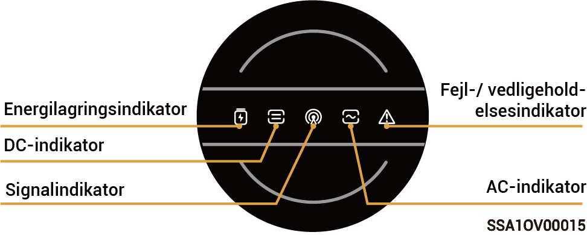
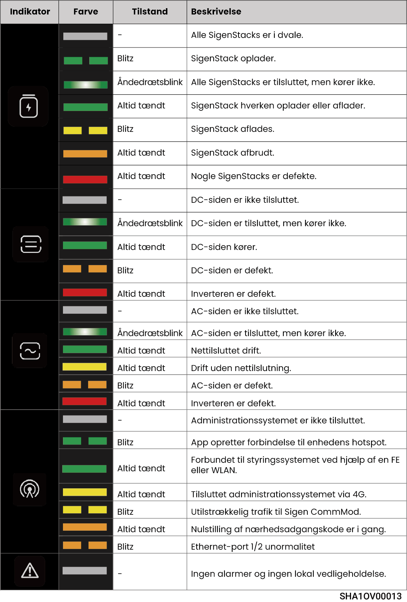
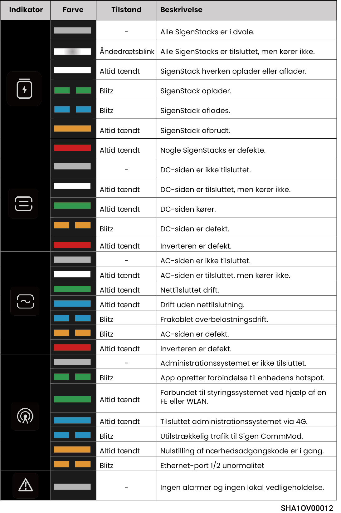

# LED-indikatortilstand

## **Inverterindikator**



<mark style="color:blue;">Der er to typer indikatorer: en gul indikator, se Lysindikatoroversigt 1, og en blå indikator, se Lysindikatoroversigt 2.</mark>

### Lysforklaring 1

<figure><figcaption></figcaption></figure>

<figure><figcaption></figcaption></figure>

### Lysforklaring 2

<figure><figcaption></figcaption></figure>

<figure><figcaption></figcaption></figure>

## **Sigen CommMod-indikator**

<figure><figcaption></figcaption></figure>

<table><thead><tr><th width="57.50506591796875" align="center">Serienummer</th><th>Navn</th><th>Tilstand</th><th>Beskrivelse</th></tr></thead><tbody><tr><td align="center">1</td><td>Strømindikator</td><td>-</td><td>-</td></tr><tr><td align="center">2</td><td>Netværksstatusindikator</td><td>Blinker langsomt (200 ms tændt/1800 ms slukket)</td><td>Netværket forbindes</td></tr><tr><td align="center">2</td><td>Netværksstatusindikator</td><td>Blinker langsomt (1800 ms tændt/200 ms slukket)</td><td>Standby</td></tr><tr><td align="center">2</td><td>Netværksstatusindikator</td><td>Blinker hurtigt (125 ms tændt/125 ms slukket)</td><td>Data overføres</td></tr></tbody></table>
