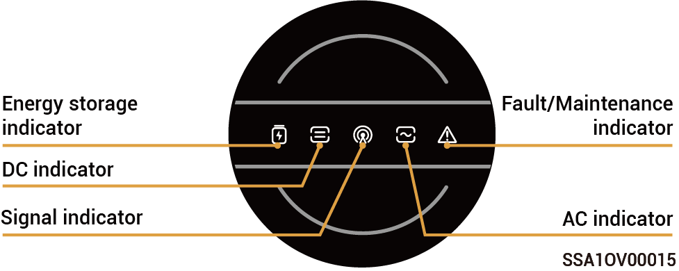
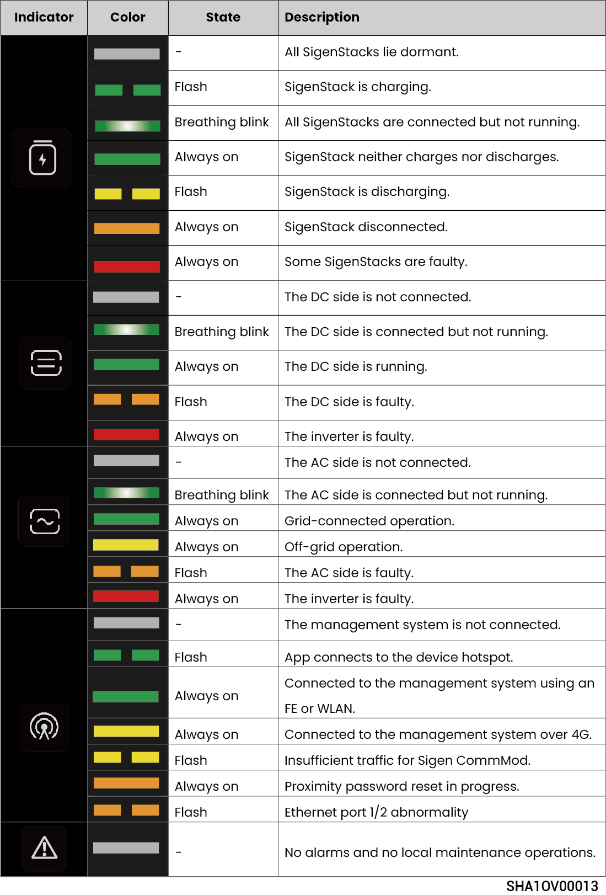
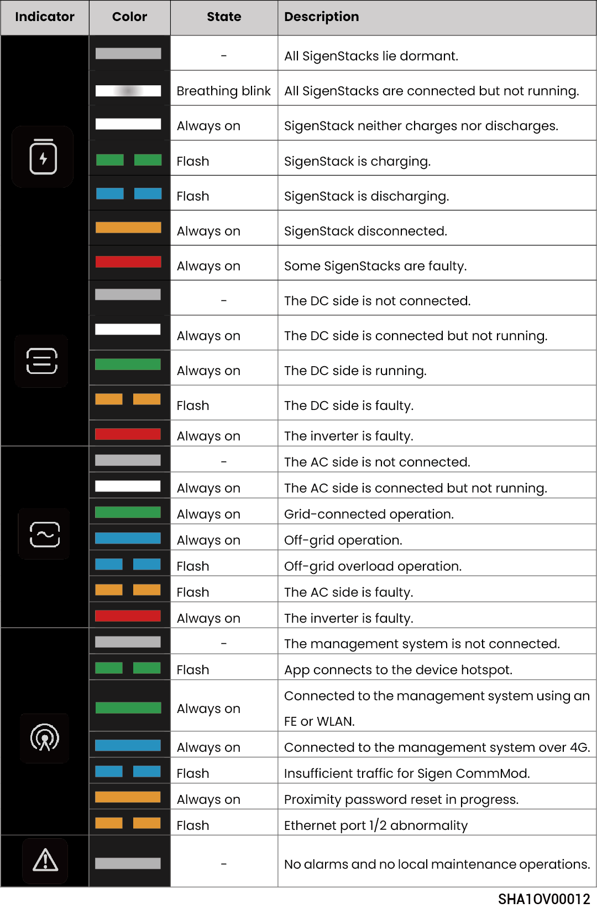
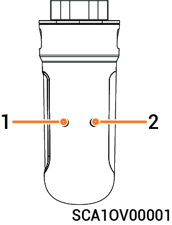

# LED Indicator State

## **Inverter Indicator**



<mark style="color:blue;">There are two types of indicators: a yellow indicator, see Light Language 1, and a blue indicator, see Light Language 2.</mark>

### Light Language 1

<figure><figcaption></figcaption></figure>

### Light Language 2

<figure><figcaption></figcaption></figure>

## **Sigen CommMod Indicator**

<figure><figcaption></figcaption></figure>

<table><thead><tr><th width="57.50506591796875" align="center">S/N</th><th>Name</th><th>State</th><th>Description</th></tr></thead><tbody><tr><td align="center">1</td><td>Power indicator</td><td>-</td><td>-</td></tr><tr><td align="center">2</td><td>Network state indicator</td><td>Slow flashing (200 ms on/1800 ms off)</td><td>The network is being connected</td></tr><tr><td align="center">2</td><td>Network state indicator</td><td>Slow flashing (1800 ms on/200 ms off)</td><td>Standby</td></tr><tr><td align="center">2</td><td>Network state indicator</td><td>Quick flashing (125 ms on/125 ms off)</td><td>Data is being transferred</td></tr></tbody></table>
