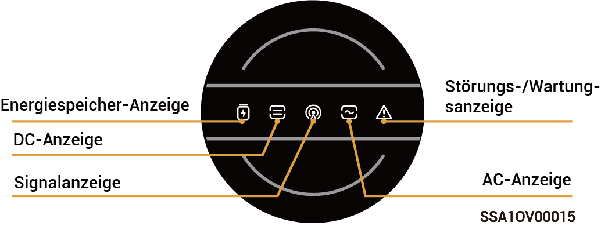
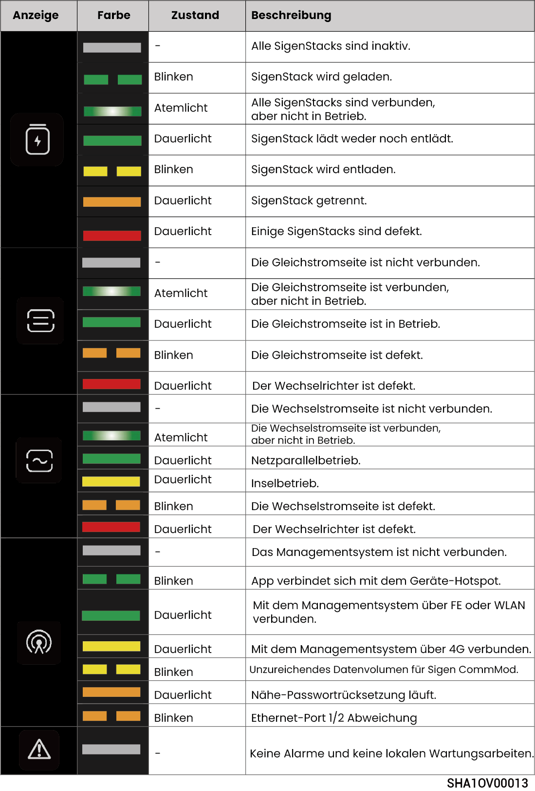
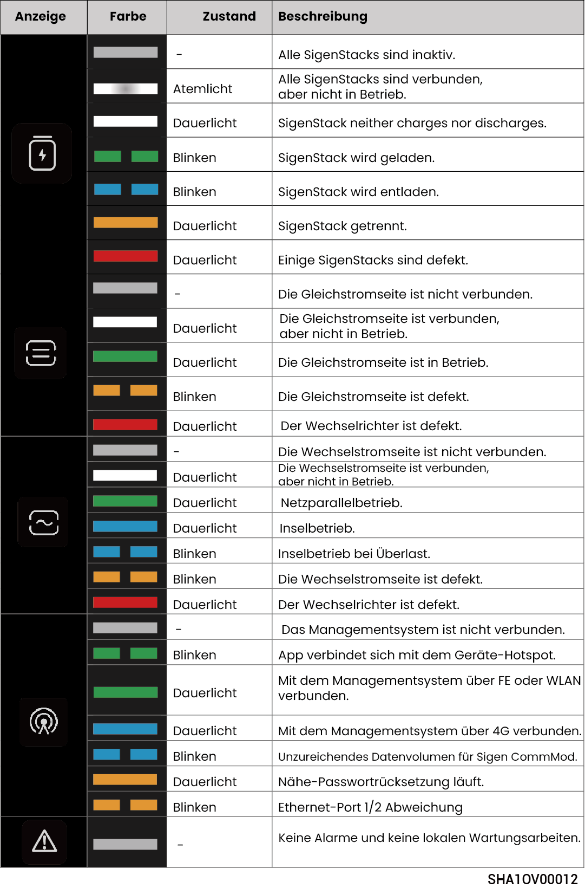

# LED-Anzeige-Status

## **Wechselrichteranzeige**



<mark style="color:blue;">Es gibt zwei Arten von Anzeigen: eine gelbe Anzeige, siehe Lichtsprache 1 und eine blaue Anzeige, siehe Lichtsprache 2.</mark>

### Lichtsprache 1

<figure><figcaption></figcaption></figure>

### Lichtsprache 2

<figure><figcaption></figcaption></figure>

## **Sigen CommMod-Anzeige**

<figure><figcaption></figcaption></figure>

<table><thead><tr><th width="57.50506591796875" align="center">Serien-Nr.</th><th>Bezeichnung</th><th>Status</th><th>Beschreibung</th></tr></thead><tbody><tr><td align="center">1</td><td>Betriebsanzeige</td><td>-</td><td>-</td></tr><tr><td align="center">2</td><td>Netzwerkstatusanzeige</td><td>Blinkt langsam (200 ms an/1800 ms aus)</td><td>Mit Netzwerk wird verbunden</td></tr><tr><td align="center">2</td><td>Netzwerkstatusanzeige</td><td>Blinkt langsam (1800 ms an/200 ms aus)</td><td>Bereitschaftszustand</td></tr><tr><td align="center">2</td><td>Netzwerkstatusanzeige</td><td>Blinkt schnell (125 ms an/125 ms aus)</td><td>Daten werden übertragen</td></tr></tbody></table>
