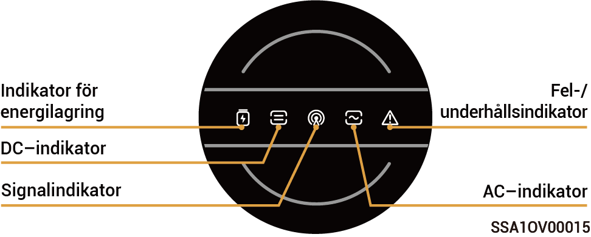
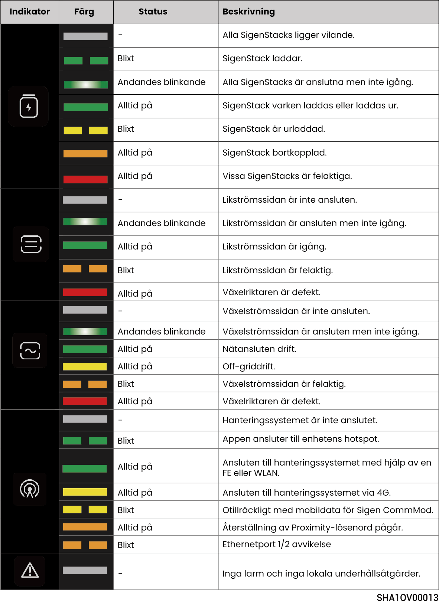
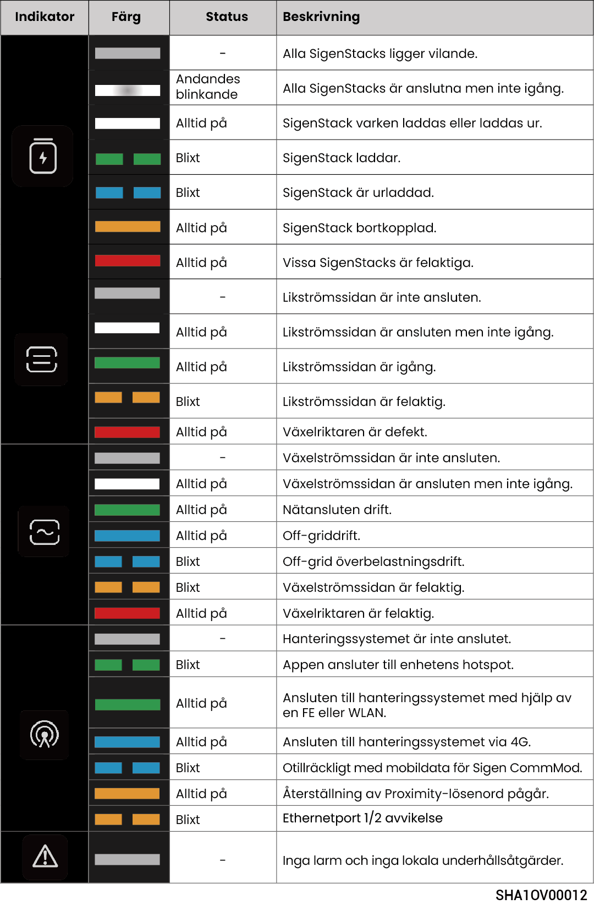

# LED-indikatorstatus

## **Växelriktarindikator**



<mark style="color:blue;">Det finns två typer av indikatorer: en gul indikator, se Ljusspråk 1, och en blå indikator, se Ljusspråk 2.</mark>

### Ljusspråk 1

<figure><figcaption></figcaption></figure>

### Ljusspråk 2

<figure><figcaption></figcaption></figure>

## **Sigen CommMod-indikator**

<figure><figcaption></figcaption></figure>

<table><thead><tr><th width="57.50506591796875" align="center">Siffra</th><th>Namn</th><th>Status</th><th>Beskrivning</th></tr></thead><tbody><tr><td align="center">1</td><td>Strömindikering</td><td>-</td><td>-</td></tr><tr><td align="center">2</td><td>Indikering av nätverksstatus</td><td>Blinkar långsamt (200 ms på/1 800 ms av)</td><td>Nätverksanslutning upprättas</td></tr><tr><td align="center">2</td><td>Indikering av nätverksstatus</td><td>Blinkar långsamt (1 800 ms på/200 ms av)</td><td>Vänteläge</td></tr><tr><td align="center">2</td><td>Indikering av nätverksstatus</td><td>Blinkar snabbt (125 ms på/125 ms av)</td><td>Data överförs</td></tr></tbody></table>
