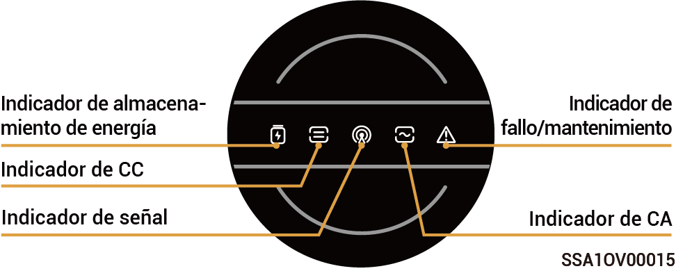
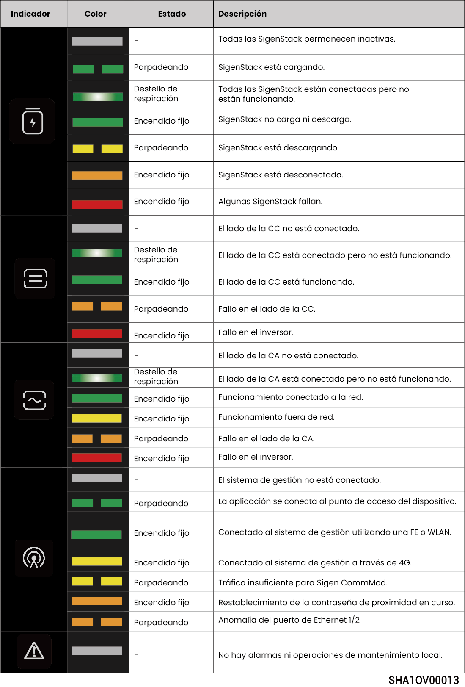
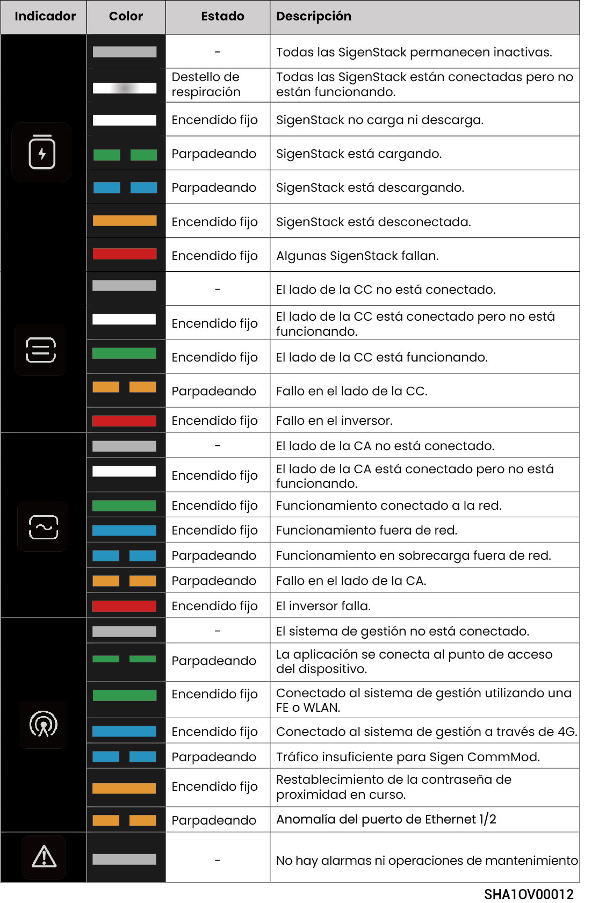

# Estado de los indicadores LED

## **Indicador del inversor**



<mark style="color:blue;">Hay dos tipos de indicadores: o bien amarillo, consulte Idioma de luces 1, o bien azul, consulte Idioma de luces 2.</mark>

### Idioma de luces 1

<figure><figcaption></figcaption></figure>

### Idioma de luces 2

<figure><figcaption></figcaption></figure>

## **Indicador Sigen CommMod**

<figure><figcaption></figcaption></figure>

<table><thead><tr><th width="57.50506591796875" align="center">N.º S.</th><th width="220.18182373046875">Denominación</th><th width="245.272705078125">Estado</th><th>Descripción</th></tr></thead><tbody><tr><td align="center">1</td><td>Indicador de alimentación</td><td>-</td><td>-</td></tr><tr><td align="center">2</td><td>Indicador del estado de red</td><td>Parpadeo lento (200 ms encendido/1800 ms apagado)</td><td>La red se está conectando</td></tr><tr><td align="center">2</td><td>Indicador del estado de red</td><td>Parpadeo lento (1800 ms encendido/200 ms apagado)</td><td>En espera</td></tr><tr><td align="center">2</td><td>Indicador del estado de red</td><td>Parpadeo rápido (125 ms encendido/125 ms apagado)</td><td>Se están transfiriendo datos</td></tr></tbody></table>
