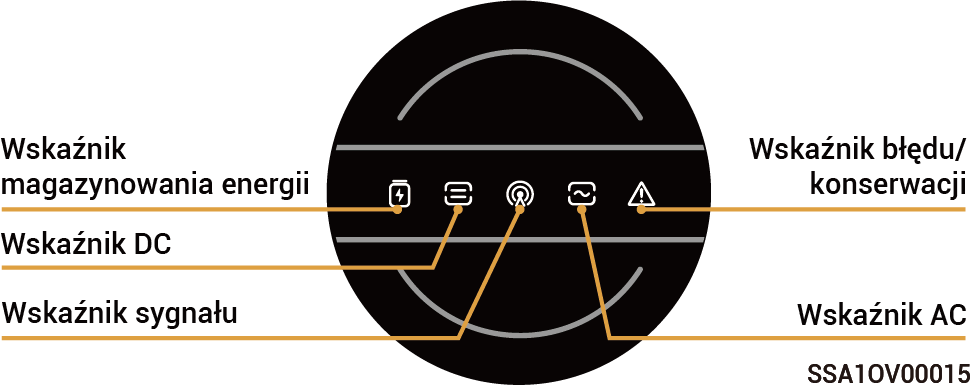
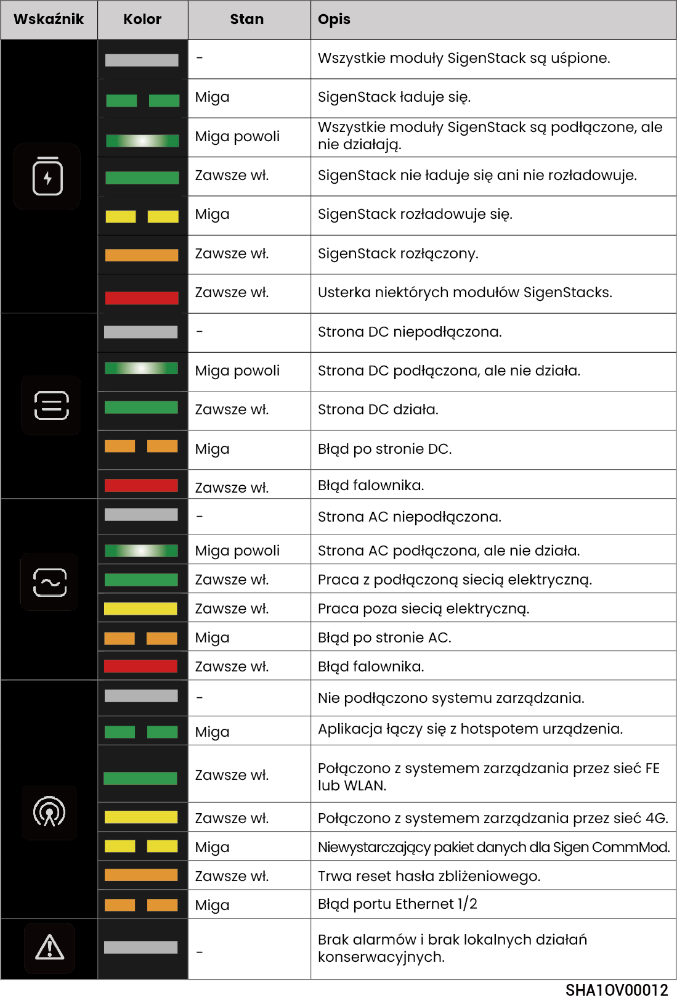
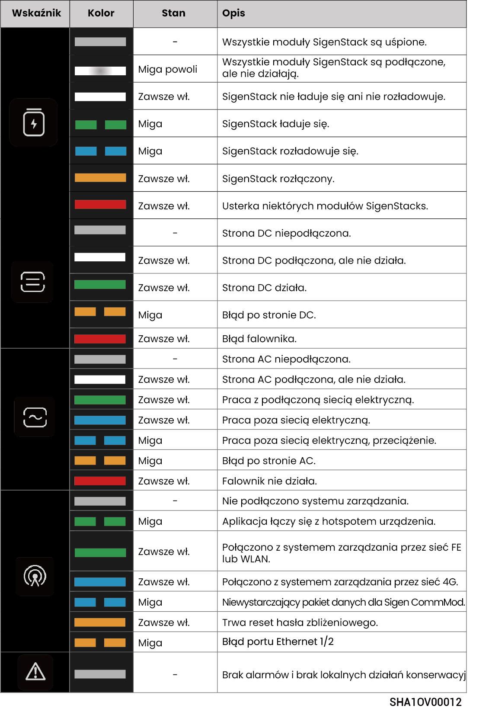

# Stan wskaźnika LED

## **Wskaźnik falownika**



<mark style="color:blue;">Istnieją dwa rodzaje wskaźników: wskaźnik żółty (patrz Sygnały świetlne 1) i wskaźnik niebieski (patrz Sygnały świetlne 2).</mark>

### Sygnały świetlne 1

<figure><figcaption></figcaption></figure>

<figure><figcaption></figcaption></figure>

### Sygnały świetlne 2

<figure><figcaption></figcaption></figure>

<figure><figcaption></figcaption></figure>

## **Wskaźnik Sigen CommMod**

<figure><figcaption></figcaption></figure>

<table><thead><tr><th width="57.50506591796875" align="center">S/N</th><th>Nazwa</th><th>Stan</th><th>Opis</th></tr></thead><tbody><tr><td align="center">1</td><td>Wskaźnik zasilania</td><td>-</td><td>-</td></tr><tr><td align="center">2</td><td>Wskaźnik stanu sieci</td><td>Miga powoli (200 ms świeci/1800 ms wyłączony)</td><td>Łączenie z siecią</td></tr><tr><td align="center">2</td><td>Wskaźnik stanu sieci</td><td>Miga powoli (1800 ms świeci/200 ms wyłączony)</td><td>Czuwanie</td></tr><tr><td align="center">2</td><td>Wskaźnik stanu sieci</td><td>Miga szybko (125 ms świeci/125 ms wyłączony)</td><td>Przesyłanie danych</td></tr></tbody></table>
