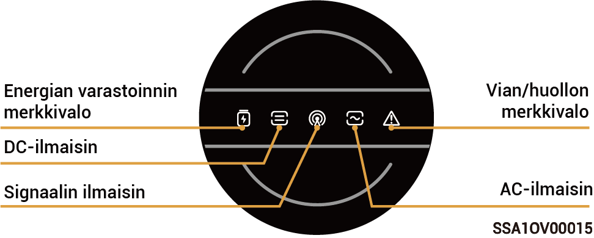
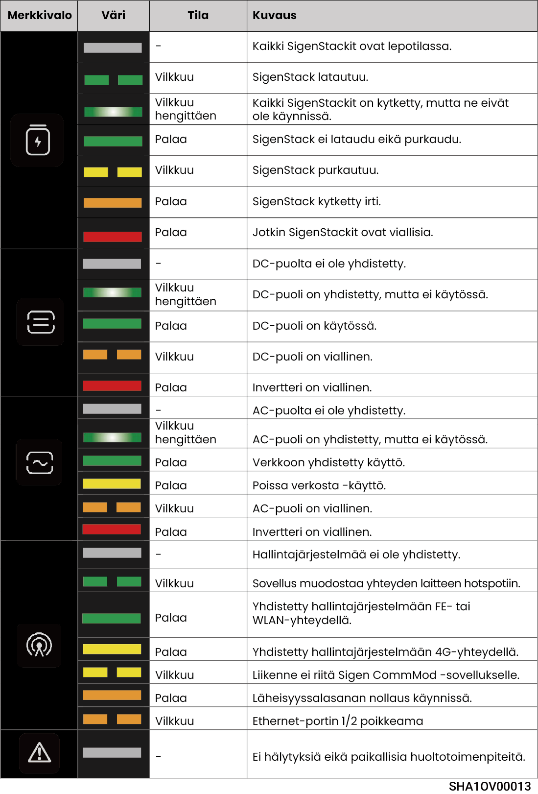
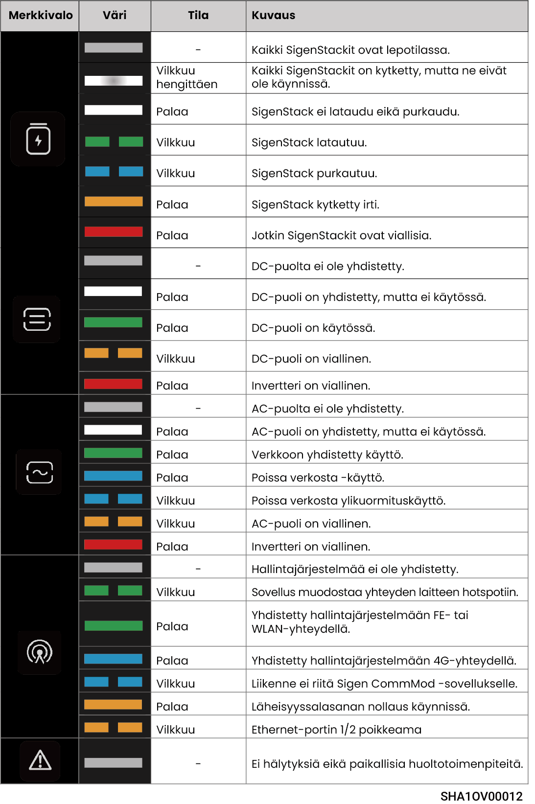

# LED-ilmaisimen tila

## **Invertterin merkkivalo**



<mark style="color:blue;">Indikaattoreita on kahta tyyppiä: keltainen indikaattori, katso Valokieli 1, ja sininen indikaattori, katso Valokieli 2.</mark>

### Valo Kieli 1

<figure><figcaption></figcaption></figure>

<figure><figcaption></figcaption></figure>

### Valo Kieli 2

<figure><figcaption></figcaption></figure>

<figure><figcaption></figcaption></figure>

## **Sigen CommMod -ilmaisin**

<figure><figcaption></figcaption></figure>

<table><thead><tr><th width="57.50506591796875" align="center">S/N</th><th>Nimi</th><th>Tila</th><th>Kuvaus</th></tr></thead><tbody><tr><td align="center">1</td><td>Virran merkkivalo</td><td>-</td><td>-</td></tr><tr><td align="center">2</td><td>Verkon tilan merkkivalo</td><td>Hidas vilkkuminen (200 ms päällä / 1800 ms pois päältä)</td><td>Verkkoa yhdistetään</td></tr><tr><td align="center">2</td><td>Verkon tilan merkkivalo</td><td>Hidas vilkkuminen (1800 ms päällä/200 ms pois päältä)</td><td>Valmiustila</td></tr><tr><td align="center">2</td><td>Verkon tilan merkkivalo</td><td>Nopea vilkkuminen (125 ms päällä / 125 ms pois päältä)</td><td>Tietoja siirretään</td></tr></tbody></table>
