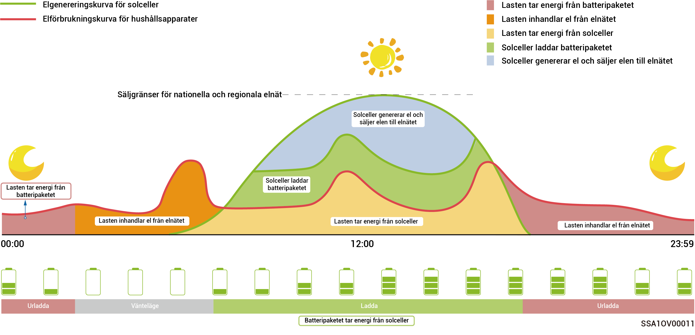
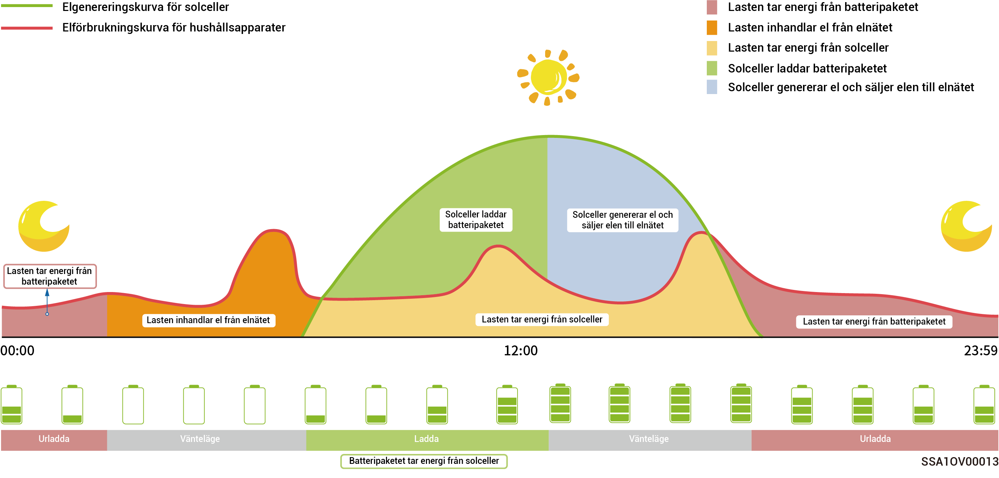
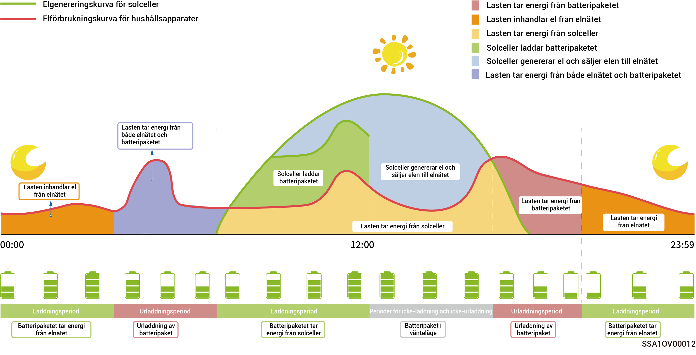

# Driftläge



<mark style="color:blue;">Energilagringssystemet har stöd för flera arbetslägen. Vissa länder stöder läget för belastningsavlastning, läget VPP schemaläggning-evergen, som är föremål för app-gränssnittsdisplayen.</mark>

## **Sigen AI**\*\*-läge\*\*

Genom att erhålla lokala högsta och lägsta elpriser samt väderprognoser, kombinerat med användarens elförbrukningsvanor, kan Sigen AI-läget skapa smarta elförbrukningslösningar för att maximera kundens kostnadsbesparingar.

<figure><figcaption></figcaption></figure>

## **Självförsörjningsläge**

* När det finns tillräckligt med solel används den elektriska energin som genereras av solcellssystemet i första hand till att försörja lasterna och överskottsenergin lagras i batterierna. Eventuell återstående energi säljs till elnätet. När solelen inte är tillräcklig frigör batterierna elektrisk energi för att försörja lasterna. Du kan spara på elräkningen genom att öka solcellssystemets proportion av självförsörjning och förbättra hushållsenergins proportion av självförsörjning.
* Detta läge lämpar sig för områden med höga elpriser eller begränsad anslutning till elnätet utan kraftleverans.

<figure><figcaption></figcaption></figure>

## **Tidsstyrningsläge**

* Perioderna för laddning, urladdning och självförsörjning måste ställas in manuellt. För att spara på elräkningen kan överskottsenergi från fotovoltaisk strömgenerering och energin i batteriet säljas till elnätet när elpriserna är höga och batteriet kan laddas under perioder av låga elpriser.
* Om inga perioder ställs in kommer energilagringssystemet att ställas i vänteläge, utan urladdning. Solcellsenergin kommer att ge prioritet åt försörjning av lasterna och överskottsenergin används för att ladda energilagringssystemet.\*
* Du kan ställa in upp till 24 perioder av laddning och urladdning eller självförsörjning.
* Det lämpar sig för områden med höga och låga elpriser samt betydande prisskillnader.

\* När denna period inleds registreras batteriets kapacitet. När solcellsenergin är större än lasten används den återstående solcellsenergin till att ladda batteriet. När solcellsenergin är mindre än lasten används kan batteriet urladdas till lasten. Dock kommer batteriet att sluta urladdas under denna period när dess kapacitet minskar och närmar sig sitt kapacitetsvärde.

<figure><figcaption></figcaption></figure>

## **Fullständig inmatning till nätet**

* Du kan sälja tillbaka överskottsenergi till elnätet och krediteras till elräkningen.
* Under dagtid, när solcellsenergin är högre än växelriktarens maximala utmatningskapacitet, upprätthåller växelriktaren maximal utmatning och lagrar samtidigt energi i batterierna. När solcellsenergin är lägre än växelriktarens maximala utmatningskapacitet, eller nattetid när ingen solcellsenergi genereras, urladdas batterierna för att säkerställa växelriktarens maximala utmatning.

## Läge VPP schemaläggning-evergen

När du har registrerat dig hos VPP kommer ditt lagringssystem att gå med i det smarta sändningsnätverket. Appen visar och aktiverar detta läge automatiskt.

## **EMS-fjärrläge**

När detta läge aktiveras kan en tredjeparts EMS schemalägga parametrar för det kraftverk och den produkt som ställts in av företaget. Detta läge ska inte aktiveras eller inaktiveras utan bekräftelse från installatören.

## **Lastfrånkopplingsläge**

I områden med ofta förekommande strömavbrott kan du lägga till din region och schemalägga detta läge så att systemet laddar batteriet i förväg enligt schemat för att tillgängliggöra batterikraft som försörjer lasterna under avbrotten. (Stöds för närvarande enbart i Sydafrika.)
