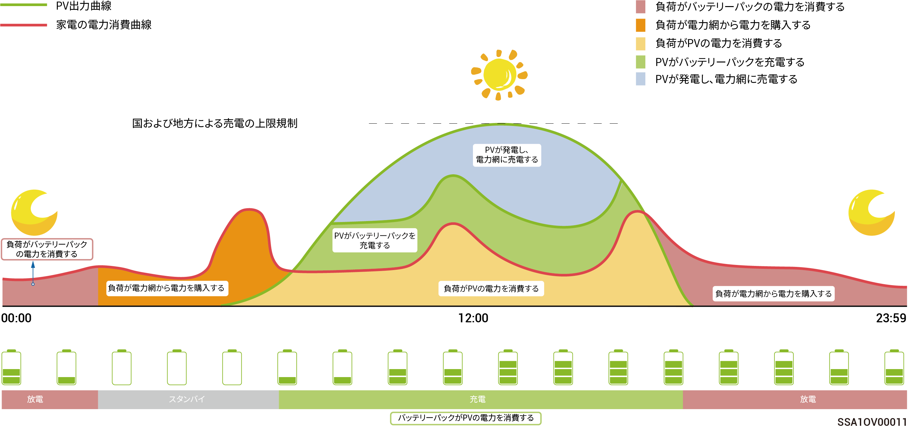
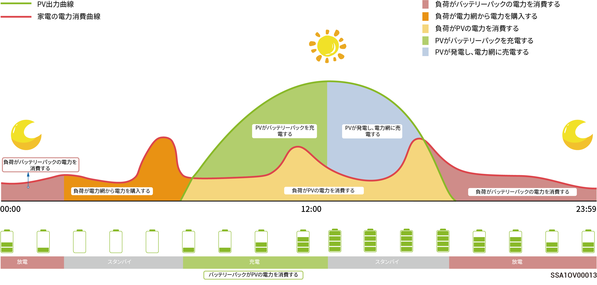
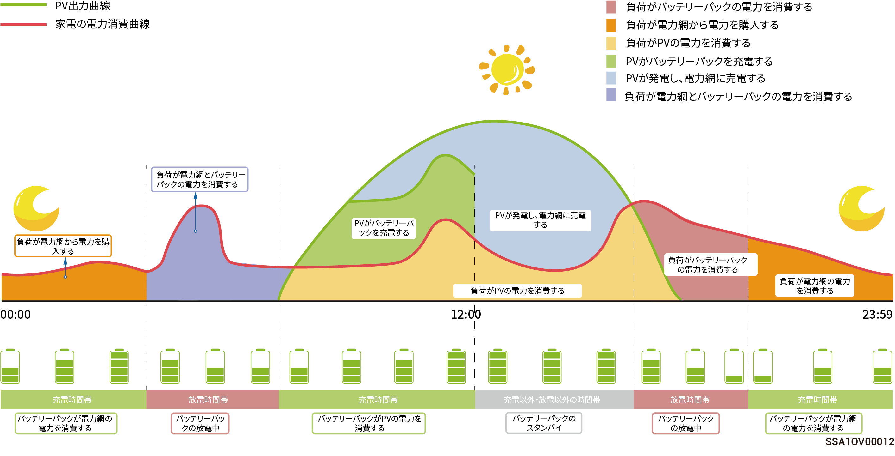

# 動作モード



<mark style="color:blue;">エネルギー貯蔵システムは2種類以上の動作モードに対応しています。一部の国では、負荷制限モードとVPP Scheduling-evergenモードに対応していますが、これらはアプリインターフェースの表示によって異なります。</mark>

## **Sigen AIモード**

Sigen AIモードは、現地のピークと谷の電気料金や気象データを取得し、使用者の電力消費習慣と組み合わせることで、インテリジェント電力使用ソリューションをカスタマイズし、できる限りコストを抑えます。

<figure><figcaption></figcaption></figure>

## **自家消費モード**

* 十分な太陽光発電の電力がある時に、まず家庭用負荷を賄うためにPVシステムが発電する電力を利用し、余った電力をバッテリーに貯蔵することになります。余剰エネルギーは電力網に売電されます。太陽光発電の電力が十分でない時、バッテリーは電気を負荷へ開放します。PVシステムの自家消費比率を引き上げ、自家消費する電力の充足度を高めることにより、支払う電気代を効果的に削減することができます。
* このモードは、電気料金が高い地域やゼロパワー電力網接続が制限されている地域に適しています。

<figure><figcaption></figcaption></figure>

## **時間設定制御モード**

* 手動で充電時間帯、放電時間帯、自家消費時間帯を設定する必要があります。電気料金が高い時間帯には、太陽光発電とバッテリーの余剰電力を電力網に売電し、電気料金が安い時間帯にはバッテリーを充電して電気代を抑えることができます。
* 時間帯を設定しない場合、蓄電システムは放電せず、スタンバイモードになります。太陽光発電は負荷への電力供給を優先し、余剰電力は蓄電システムの充電に使用されます。\*
* 充放電時間帯と自家消費時間帯は、24個まで設定できます。
*   これは、電気料金にピークと谷があり、その価格差がきわめて大きい地域に適しています。

    \*この時間帯を入力すると、バッテリーの容量が記録されます。太陽光発電量が負荷よりも大きい場合、残りの太陽光発電量でバッテリーを充電します。太陽光発電量が負荷よりも小さい場合、バッテリーから負荷へ放電することができます。ただし、この時間帯に入る際にバッテリーの容量が減少してバッテリー容量値に近づいていると、バッテリーは放電を停止します。

<figure><figcaption></figcaption></figure>

## **電力網への完全売電モード**

* 余剰電力を売電し、電気料金の払い戻しが受けられます。
* PV電力がインバーターの最大出力容量を超える日中は、インバーターが最大出力を維持し、余剰電力をバッテリーに蓄電します。PV電力がインバーターの最大出力容量を下回る場合、もしくはPV発電が行われない夜間の場合、バッテリーを放電してインバーターの出力を最大にします。

## **VPP Scheduling-evergenモード**

VPPに登録すると、お使いの蓄電システムがスマートディスパッチネットワークに加入します。アプリにこのモードが表示され、自動的に有効になります。

## **リモートEMSモード**

このモードに設定すると、サードパーティ製のEMSで、発電所関連のパラメータと電力会社が設定した製品のスケジュールを立てることができます。設置業者の確認を受けずに、このモードを起動または終了しないでください。

## **負荷制限モード**

停電が頻繁に発生する地域では、このモードによって、その地域とスケジュールを追加することができます。すると、スケジュールに従って事前にバッテリーが満充電され、停電時に負荷に供給できるようにバッテリー電力を確保します。（これは現在は南アフリカでのみサポートされています）
