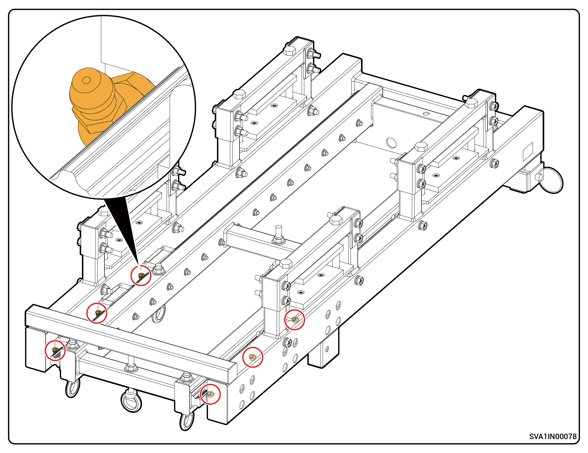

# 例行维护

为了保障设备能够长期良好运行，建议按照本章节的描述对其进行例行维护。

<table><thead><tr><th width="131.77783203125">检查内容</th><th width="312">检查方法</th><th width="99" align="center">是否关机</th><th>维护周期</th></tr></thead><tbody><tr><td>系统清洁</td><td>定期检查设备有无遮挡及灰尘脏污，若有，请清理。清理时禁止使用可能导致触电或绝缘破坏的工具，如钢丝刷、湿毛巾等。</td><td align="center">是</td><td>3个月1次。</td></tr><tr><td>系统运行状态</td><td><ul><li>观察设备外观是否有损坏或者变形。</li><li>听设备在运行过程中是否有异常声音。</li><li>在设备运行时，检查设备各项参数是否设置正确。</li></ul></td><td align="center">否</td><td>6个月1次。</td></tr><tr><td>电气连接</td><td><ul><li>检查线缆端子连接是否松脱。</li><li>检查线缆表面是否有损坏。</li><li>检查线缆与金属接触的表皮是否有划痕。</li><li>检查未使用的走线孔是否处于密封状态。</li></ul></td><td align="center">是</td><td>开局后6个月检查1次，之后间每隔6~12月1次。</td></tr><tr><td>工具保养</td><td>吊装工具保养：通过注油口注入润滑脂，海边或其他恶劣场景须缩短注油周期。注油口位置参见图1。</td><td align="center">是</td><td>1个月1次</td></tr><tr><td>接地可靠性</td><td>检查接地线缆是否完整、可靠连接。</td><td align="center">否</td><td>开局后6个月检查1次，之后间每隔6~12月1次。</td></tr></tbody></table>

图1

<figure><figcaption></figcaption></figure>

