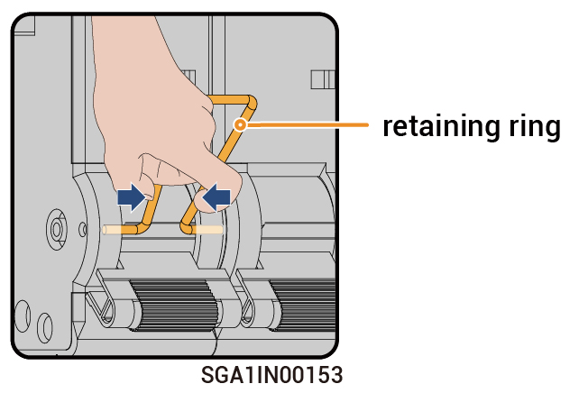

# Schließvorgang des Bypass-Schalters



<mark style="color:blue;">**Wenn eine abnormale Funktion des Netzschützes des Gateways die Stromversorgung der Last verhindert, schließen Sie den Bypass-Schalter, um die Last direkt vom Netz mit Strom zu versorgen.**</mark>

### **Schritte**

1. Überprüfen Sie, ob das Stromnetz normal Strom liefert.
2. Schalten Sie das Gerät unter Bezugnahme auf [Ausschalten](../she-bei-xia-dian/) aus.
3. Beziehen Sie sich auf die Verzögerungszeit der Beschriftung und warten Sie den angegebenen Zeitraum ab. Sobald der Zeitraum abgelaufen ist, entfernen Sie den Sicherungsring vom Umgehungsschalter und schalten Sie ihn ein.

<figure><figcaption></figcaption></figure>



* <mark style="color:orange;">Es besteht Reststrom und das Gerät ist sofort nach dem Ausschalten heiß. Der Gerätebetrieb sofort nach dem Ausschalten kann zum Stromschlag und Verbrennungen führen.</mark>
* <mark style="color:orange;">Das Gerät steht unter Hochspannung. Beim Bedienen des Schalters Isolierhandschuhe tragen.</mark>



<mark style="color:purple;">Nach dem Einschalten des Umgehungsschalters darf der an den Wechselrichter und den Generator angeschlossene Kompaktleistungsschalter am Gateway nicht eingeschaltet werden. Andernfalls wird der Stromnetzanschluss aufgeladen, was zu einem Stromschlag führen kann.</mark>

4. Schalten Sie den an den Überspannungsschutz angeschlossenen Kompaktleitungsschutzschalter ein.
5. Schalten Sie den an das Stromnetz angeschlossenen Kompaktleistungsschalter ein.
6. Schalten Sie den an die Notstrom-Haushaltslasten angeschlossenen Kompaktleistungsschalter ein.
7. Schließen Sie die Gerätetür.
