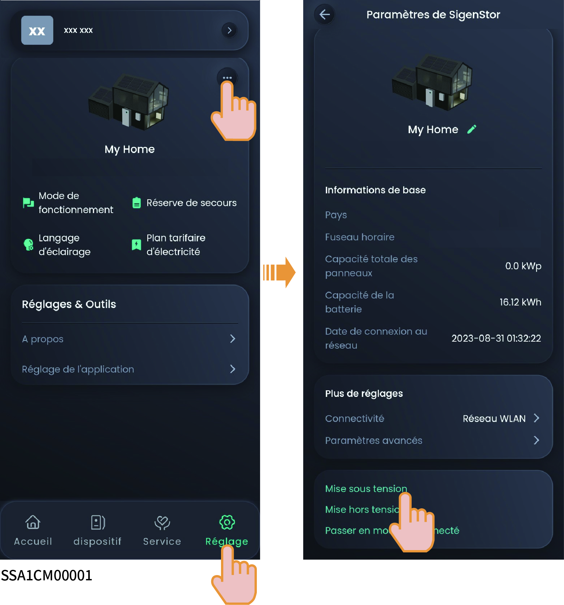

# Mise sous/hors tension de l'équipement

### **Méthode 1 : à partir de l'application**

Dans l'application mySigen, appuyez sur « Paramètres » pour allumer ou éteindre l'appareil.

<figure><figcaption></figcaption></figure>

### Méthode 2 : manuellement

Suivez les étapes indiquées pour retirer les couvercles décoratifs latéral et supérieur, puis appuyez sur le bouton de commutation ON/OFF.



<mark style="color:blue;">Appuyez sur le bouton et maintenez-le enfoncé pendant plus de 3 s pour mettre l'appareil sous tension ou hors tension. Un délai de plus de 10 s est généralement nécessaire entre la mise sous tension et la mise hors tension de l'appareil.</mark>

<figure><figcaption></figcaption></figure>



<mark style="color:blue;">Les mises à niveau importantes des micrologiciels peuvent échouer si l'équipement n'est pas connecté à Internet pendant une période prolongée. Si votre équipement n'est pas connecté à Internet, le système vous adressera plusieurs rappels. Si le système ne reçoit pas de retour d'information de votre part pendant un certain temps, il fonctionnera en conditions limitées pour des raisons de sécurité. Si vous souhaitez que l'équipement soit pleinement fonctionnel, connectez-le à Internet. Le fonctionnement du système sera automatiquement rétabli. Si vous avez d'autres questions, n'hésitez pas à nous contacter pour obtenir de l'aide.</mark>
