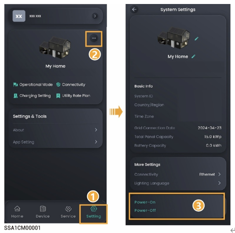

# Equipment Power-on/Power-off

### **Scheme 1: App operation**

In the mySigen app, tap "Settings" to turn the device on or off.

<figure><figcaption></figcaption></figure>

### **Scheme 2: Manual operation**

Follow the steps shown to remove the side and top decorative cover, and press the ON/OFF switch button.



<mark style="color:blue;">Press and hold for more than 3s to turn on or off the power; an interval of more than 10s is needed between power-on and power-off.</mark>

<figure><figcaption></figcaption></figure>



<mark style="color:blue;">Major firmware upgrades can fail if the equipment is not connected to the internet for an extended period of time. When your equipment is not connected to the internet, the system will send you a reminder repeatedly. If the system does not receive feedback from you for a long time, the system will operate under limited conditions for security reasons. If you want to make the equipment fully functional, connect the equipment to the internet. The system will automatically restore its functionality. If you have further questions, please contact us for assistance.</mark>
