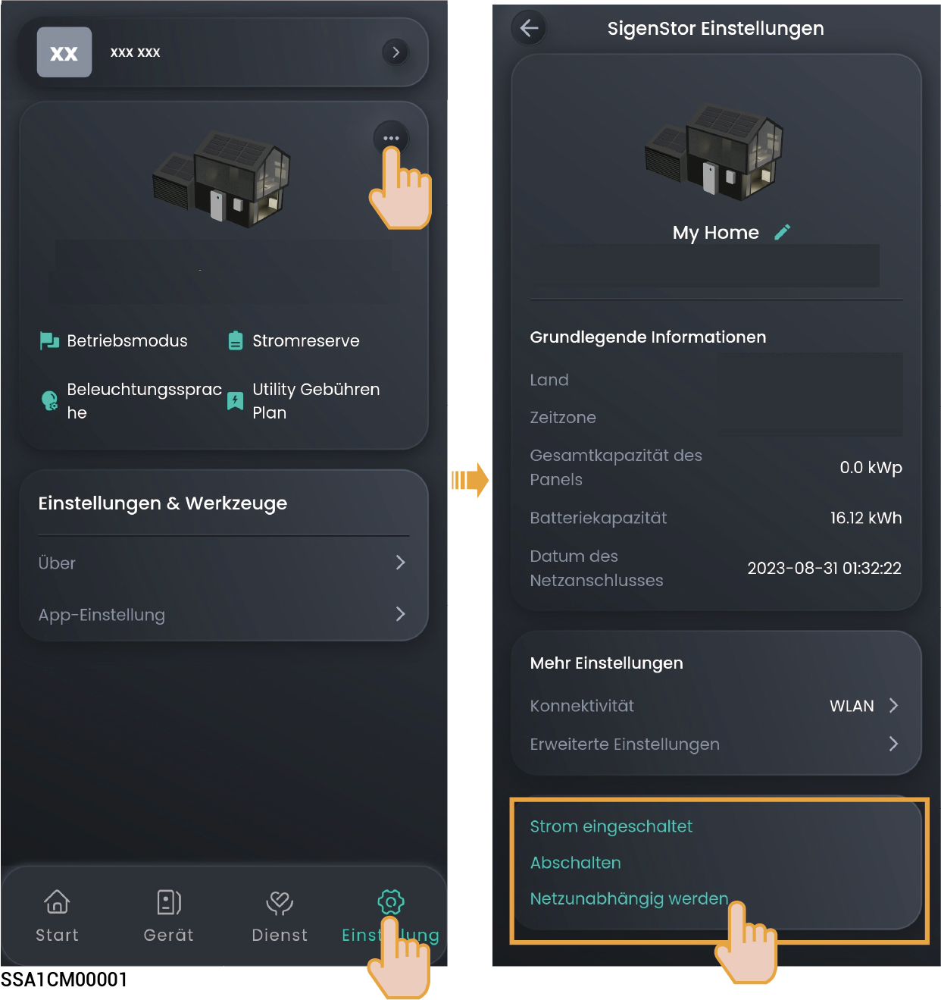

# Gerät ein-/ausschalten

### **Schema 1: App-Betrieb**

Tippen Sie in der mySigen-App auf „Einstellungen“, um das Gerät ein- oder auszuschalten.

<figure><figcaption></figcaption></figure>

### **Schema 2: Manueller Betrieb**

Befolgen Sie die Schritte, um die seitliche und obere Zierabdeckung zu entfernen und drücken Sie danach auf die Schaltertaste ON/OFF.



<mark style="color:blue;">Halten Sie die Taste länger als 3 Sekunden gedrückt, um das Gerät ein- oder auszuschalten. Zwischen dem Einschalten und dem Ausschalten ist ein Intervall von mehr als 10 Sekunden erforderlich.</mark>

<figure><figcaption></figcaption></figure>



<mark style="color:blue;">Firmware-Hauptaktualisierungen können bei langen Verbindungsunterbrechung zum Internet fehlschlagen. Wenn Sie nicht mit dem Internet verbunden sind, sendet das System wiederholt eine Erinnerung. Wenn das System von Ihnen über einen längeren Zeitraum keine Rückmeldung erhält, arbeitet es aus Sicherheitsgründen unter begrenzten Zuständen. Wenn Sie die volle Funktionsfähigkeit des Systems erhalten möchten, verbinden Sie das Gerät mit dem Internet. Das System stellt seine Funktionsfähigkeit automatisch her. Wenn Sie weitere Fragen haben, wenden Sie sich bitte zwecks Unterstützung an uns.</mark>
