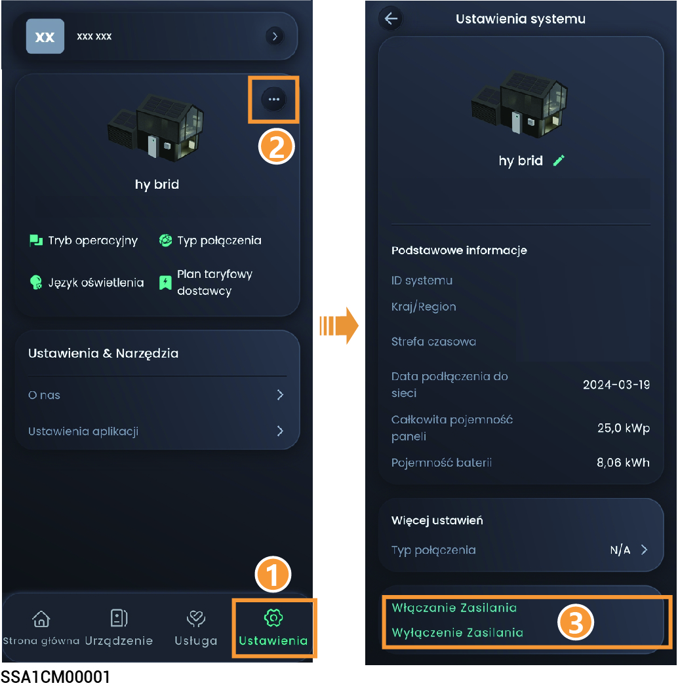

# Włączanie/wyłączanie urządzenia

### **Procedura 1: W aplikacji**

W aplikacji mySigen nacisnąć „Ustawienia”, aby włączyć lub wyłączyć urządzenie.

<figure><figcaption></figcaption></figure>

### Procedura 2: Obsługa ręczna

Postępując zgodnie z poniższymi instrukcjami, zdjąć boczną i górną pokrywę dekoracyjną, a następnie nacisnąć przycisk ON/OFF.



<mark style="color:blue;">Przytrzymać przycisk przez ponad 3 sekundy, aby włączyć lub wyłączyć zasilanie; pomiędzy włączeniem i wyłączeniem zasilania wymagany jest odstęp dłuższy niż 10 s.</mark>

<figure><figcaption></figcaption></figure>



<mark style="color:blue;">Główne uaktualnienia oprogramowania sprzętowego mogą się nie powieść, jeśli sprzęt nie będzie przez dłuższy czas podłączony do internetu. Gdy urządzenie nie jest podłączone do internetu, system będzie wielokrotnie wysyłał przypomnienia. Jeśli przez dłuższy czas system nie otrzyma od użytkownika informacji zwrotnej, będzie działał w ograniczonych warunkach ze względów bezpieczeństwa. Aby sprzęt był w pełni funkcjonalny, należy połączyć go z internetem. System automatycznie przywróci jego funkcjonalność. W razie dalszych pytań prosimy o kontakt; udzielimy pomocy.</mark>
