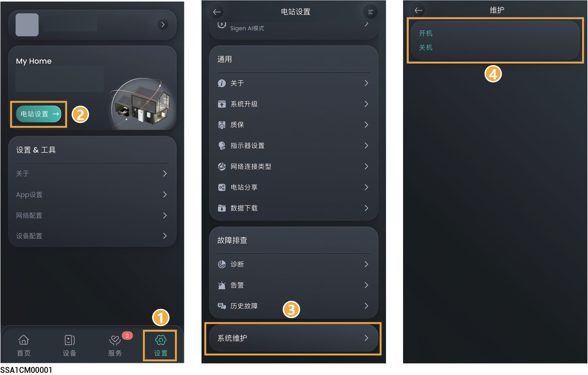

# 设备开关机

在App中点击“设置”，可进行开关机操作。

<figure><figcaption></figcaption></figure>



<mark style="color:blue;">如果设备连续长时间未联网，我们将无法为设备提供重要的固件版本升级。当您的设备出现未联网情况时，系统定期发送提醒，若＞90天持续未联网，出于安全考虑，系统将进入安全运行模式。请您尽快连接网络，若您还有疑问，可联系本公司进行处理。</mark>
