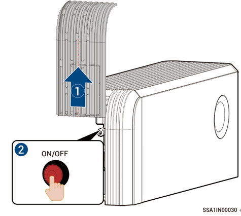

# Laitteen virran kytkeminen/katkaiseminen

### **Vaihtoehto 1: Sovelluksen käyttäminen**

Kytke laite päälle tai pois päältä menemällä mySigen-sovellukseen ja napauttamalla ”Settings” (Asetukset).

<figure><figcaption></figcaption></figure>

### **Vaihtoehto 2: Manuaalinen toimenpide**

Poista sivun ja yläosan koristekansi noudattamalla näytössä näkyviä ohjeita ja paina PÄÄLLE/POIS-kytkinpainiketta.



<mark style="color:blue;">Pidä painiketta painettuna vähintään 3 sekunnin ajan kytkeäksesi virran päälle tai pois päältä. Virran päälle ja pois päältä kytkemisen välillä on oltava vähintään 10 sekunnin tauko.</mark>

<figure><figcaption></figcaption></figure>



<mark style="color:blue;">Tärkeät laiteohjelmistopäivitykset voivat epäonnistua, jos laite ei ole yhteydessä internetiin pitkään aikaan. Kun laite ei ole yhteydessä internetiin, järjestelmä lähettää säännöllisesti ilmoituksia. Jos yhteys on katkennut yli 90 peräkkäisen päivän ajaksi, järjestelmä siirtyy automaattisesti turvatoimintatilaan turvallisuussyistä. Yhdistä laite välittömästi internetiin. Jos ongelma ei ratkea, ota meihin yhteyttä.</mark>
