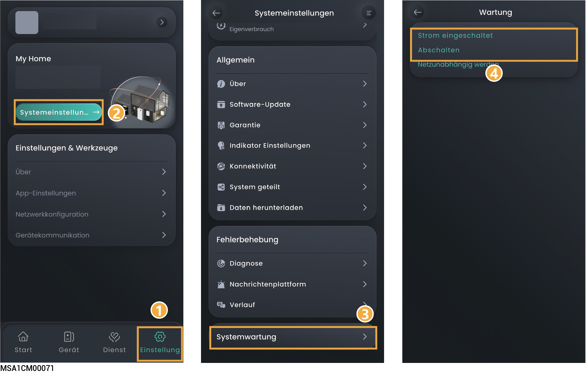

# Gerät ein-/ausschalten

### **Schema 1: App-Betrieb**

Tippen Sie in der mySigen-App auf „Einstellungen“, um das Gerät ein- oder auszuschalten.

<figure><figcaption></figcaption></figure>



<mark style="color:blue;">Firmware-Hauptaktualisierungen können bei langen Verbindungsunterbrechung zum Internet fehlschlagen. Wenn Ihr Gerät nicht mit dem Internet verbunden ist, gibt das System in regelmäßigen Abständen Benachrichtigungen aus. Wenn die Unterbrechung länger als 90 aufeinanderfolgende Tage andauert, wechselt das System automatisch in den sicheren Betriebsmodus, um die Sicherheit zu gewährleisten. Stellen Sie die Verbindung zum Internet sofort wieder her. Bei ungelösten Problemen können Sie uns gerne kontaktieren.</mark>
