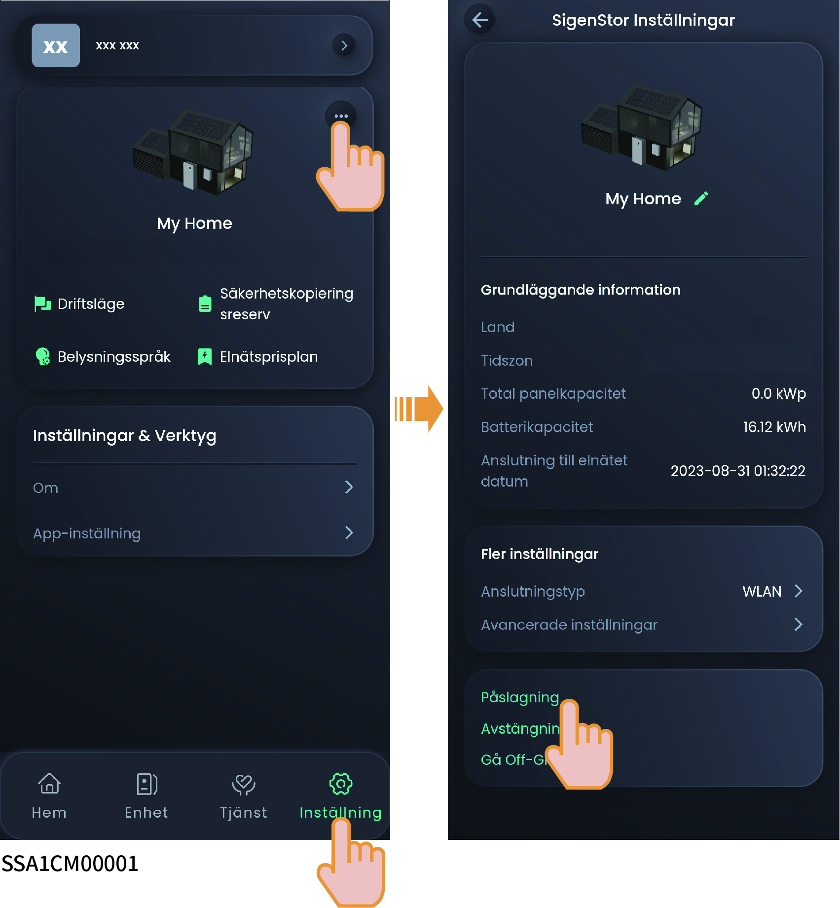

# Slå på/stänga av utrustningen

### **Metod 1: Hantera med appen**

I mySigen-appen, tryck på ”Inställningar” för att slå på eller stänga av enheten.

<figure><figcaption></figcaption></figure>

### Metod 2: Hantera manuellt

Följ stegen som visas för att avlägsna den dekorativa plattan på sidan och toppen och tryck på ON/OFF-strömbrytaren.



<mark style="color:blue;">Tryck och håll in i minst tre sekunder för att slå på eller stänga av – det ska finnas ett intervall på över 10 sekunder mellan på- och avslagning.</mark>

<figure><figcaption></figcaption></figure>



<mark style="color:blue;">Större uppgraderingar av fast programvara kan misslyckas om utrustningen inte är uppkopplad till internet under en längre period. När utrustningen inte är uppkopplad till internet kommer systemet att skicka dig upprepade påminnelser. Om systemet inte får svar från dig under en längre stund kommer det av säkerhetsskäl att drivas under begränsade förhållanden. Koppla upp utrustningen till internet för ett fullt fungerande system. Systemet återställer då alla dess funktioner. Kontakta oss om du har ytterligare frågor eller behöver hjälp.</mark>
