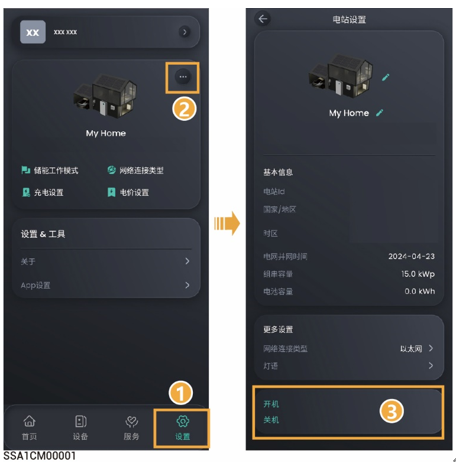
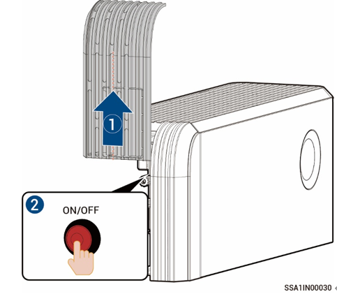

# 设备开关机

### 方案一：App操作

在思格云APP中点击“Setting”，可进行开关机操作。

<figure><figcaption></figcaption></figure>

### 方案二：手动操作

按照图示步骤将侧边和顶部装饰盖取下，并按下ON/OFF开关按钮即可。



<mark style="color:blue;">长按＞3s，可实现开机或关机；开机与关机之间需间隔＞10s。</mark>

<figure><figcaption></figcaption></figure>



<mark style="color:blue;">**如果设备连续长时间未联网，我们将无法为设备提供重要的固件版本升级。当您的设备出现未联网情况时，系统将反复发送提醒，若长时间未收到您的反馈，出于安全考虑，系统将受限运行。若您需要继续使用设备完整功能，请将设备接入网络，系统将自动恢复设备功能。若您还有疑问，可联系本公司进行处理。**</mark>
