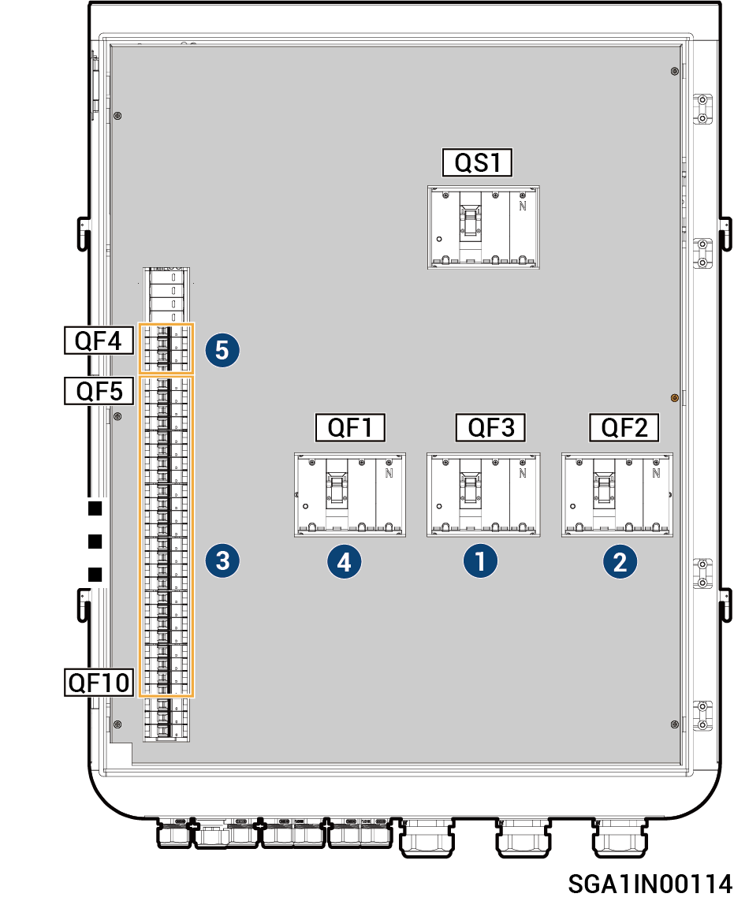

# Sigen Gateway (C120-6, TPLV C70-6)

<figure><figcaption></figcaption></figure>



<mark style="color:orange;">请按如下顺序分闸：</mark>

1. <mark style="color:orange;">断开塑壳断路器QF3（连接备电负载）。</mark>
2. <mark style="color:orange;">断开塑壳断路器QF2（连接发电机）。</mark>
3. <mark style="color:orange;">在手机端APP将逆变器关机后，断开塑壳断路器QF5\~QF10（连接逆变器）。</mark>
4. <mark style="color:orange;">断开塑壳断路器QF1（连接电网）。</mark>
5. <mark style="color:orange;">断开浪涌保护器开关QF4。</mark>
